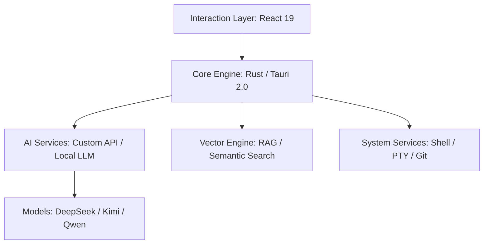

# 若爱 (IfAI) — AI 原生代码编辑器 🚀

<div align="center">
  
  <p><strong>🤖 不只是编辑器，更是你的自主编程伙伴</strong></p>
  <p>基于 Tauri 2.0 + React 19 构建的高性能、本地优先的混合智能编辑器</p>

  [简体中文](README.md) | [English](README_EN.md) | [📖 完整文档](./docs) | [🎯 下载发布页](https://github.com/peterfei/ifai/releases)

  [](LICENSE)
  [](https://tauri.app/)
  [](https://ai-native.dev)
  [](https://github.com/peterfei/ifai#performance)
</div>

---

<div align="center">
  
</div>

---

## 💡 为什么选择 IfAI?

在 AI 时代，编辑器不应只是代码的容器，而应是 AI 的躯体。IfAI 采用 **AI 原生 (AI-Native)** 架构，将推理能力深度植入内核。

*   **⚡ 极致性能**：Rust 内核驱动，120 FPS 满帧渲染，即使在万级数据负载下依然丝滑。
*   **🛡️ 隐私与本地优先**：支持 Qwen2.5 等端侧模型，敏感代码不出本地，混合路由自动切换。
*   **🐚 自主 Agent 进化**：不止于对话，Agent 具备 Shell 级操控权，自动配置环境、执行任务、自我纠错。
*   **📑 规范驱动 (OpenSpec)**：深度融合 OpenSpec 协议，确保 AI 遵循工业级设计规范。

---

## 🚀 发展里程碑

我们保持极速迭代，平均每周发布一个重磅版本。

| 版本 | 主题 | 核心突破 |
| :--- | :--- | :--- |
| **v0.2.6** | **Agent 进化** | **Shell 能力解锁、结构化任务树、OpenSpec 深度融合、Markdown 预览** |
| **v0.2.5** | 混合智能 | 本地 LLM 支持 (Qwen2.5-Coder)、智能路由、离线代码补全 |
| **v0.2.4** | 体验极致化 | Windows 渲染深度优化、零闪屏生成、稳定性飞跃 |
| **v0.2.0** | 性能革命 | 120 FPS 高刷支持、GPU 加速、Claude-style 流式交互 |

---

## ✨ 核心特性

### 🤖 智能体引擎 (The Agent Engine)
*   **Shell 级掌控**：Agent 可执行 `npm`, `git`, `cargo` 等命令，自主完成依赖安装与环境自愈。
*   **结构化任务拆解**：自动将模糊需求转化为可视化的 **Task Tree**，支持进度实时追踪。
*   **智能路径感知**：自动校准执行路径，有效防止 AI 陷入源码目录或权限陷阱。

### 🔍 检索增强 (Next-Gen RAG)
*   **多维度混合检索**：结合关键词与语义向量，毫秒级定位全项目代码上下文。
*   **项目隔离架构**：强制索引重置机制，确保多项目切换时上下文绝对纯净。

### 🎨 现代化开发体验
*   **专业 Markdown 支持**：实时预览预览引擎，支持分屏、全屏多种文档写作模式。
*   **代码片段管理**：Snippet Manager 支持万级数据量，配合 **Fill-In-the-Middle** 智能补全。
*   **Token 成本看板**：实时计量消耗，详细分解输入/输出 Token，成本尽在掌握。

---

## 📊 性能表现 (Performance)

我们对 v0.2.6 进行了严苛的工业级极限压测：

*   **海量列表滚动**：10,000+ 条记录，稳定保持 **120 FPS**，批量插入仅需 **1003ms**。
*   **渲染零延迟**：高频流式输出场景，UI 响应延迟 **< 15ms**，CPU 占用降低 **30%**。
*   **秒级环境感知**：路径校准与环境检测耗时 **< 1ms**，成功率 **100%**。

---

## 🛠 技术架构



---

## 📦 快速开始

### 1. 环境准备
确保已安装 Node.js >= 18 和 Rust >= 1.80。

### 2. 快速启动
```bash
git clone https://github.com/peterfei/ifai.git
cd ifai
npm install
npm run tauri dev
```

### 3. 构建发布
```bash
npm run build:community  # 构建前端
npm run tauri:community  # 构建 Tauri 应用
```

---

## 🤝 参与贡献

IfAI 处于高速成长期，我们欢迎任何形式的贡献！无论是 Bug 修复、特性建议还是文档改进。

- **反馈问题**: [GitHub Issues](https://github.com/peterfei/ifai/issues)
- **加入讨论**: [GitHub Discussions](https://github.com/peterfei/ifai/discussions)

---

<div align="center">
  <p><strong>Made with ❤️ by peterfei</strong></p>
  <p>如果 IfAI 帮助到了你，请点个 ⭐️ 支持我们！</p>
</div>