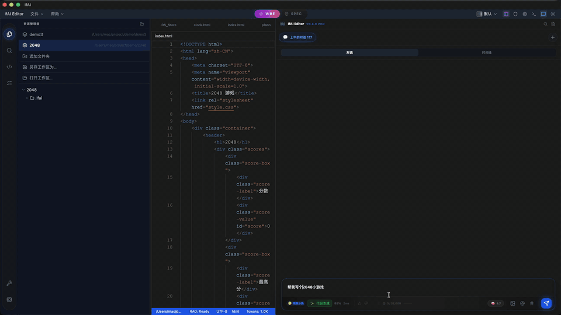
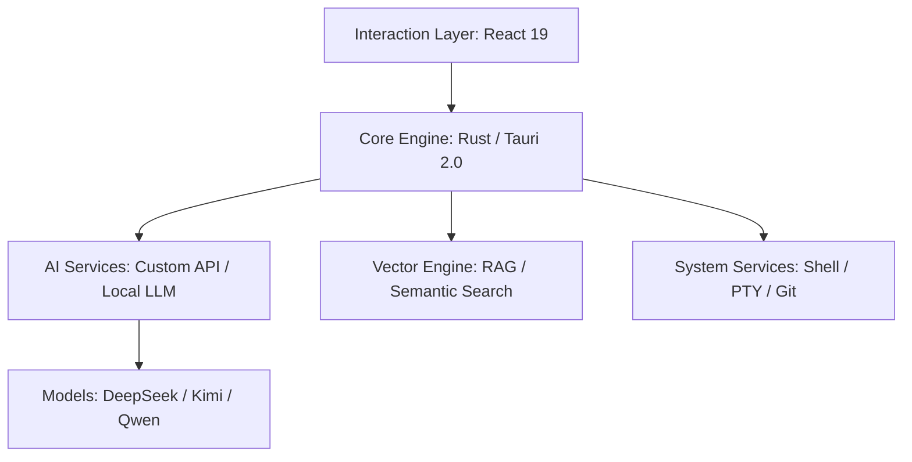

# 若爱 (IfAI) — AI 原生代码编辑器 🚀

<div align="center">
  
  <p><strong>不只是编辑器，更是你的自主编程伙伴</strong></p>
  <p>基于 Tauri 2.0 + React 19 构建的高性能、本地优先的混合智能编辑器</p>

  [简体中文](README.md) | [English](README_EN.md) | [📖 完整文档](https://docs.ifai.today/) | [🎯 下载发布页](https://github.com/peterfei/ifai/releases)

  [](https://github.com/peterfei/ifai/releases)
  [](LICENSE)
  [](https://tauri.app/)
  [](https://ai-native.dev)
  [](https://github.com/peterfei/ifai#performance)
</div>

---

### 🌟 v0.4.6 新特性：多线程并发对话系统 & TUI 架构重构
- **多线程并发对话系统**：Per-Thread Session 隔离，支持多个 AI 对话线程同时运行，Arc<Mutex> 三阶段锁策略，ThreadEvent 类型安全事件路由，并发 Streaming + 审批隔离。
- **/thread 系列斜杠命令**：`/thread new` 创建、`/thread list` 列出、`/thread switch <id>` 切换、`/thread close` 关闭线程，线程模式弹出框渲染。
- **多行输入支持**：Shift+Enter/Alt+Enter/Ctrl+J 换行，智能自动滚动，焦点恢复修复。
- **TUI God Object 重构 Phase 1-4**：App struct 从 27 字段降至 14 字段（5 个子系统提取），Mode enum 替代 5 个布尔标志（consumed 消除），声明式路由表替代 if-else（handle_single_key_event 238→158 行），StreamState cleanup 统一为单一入口。
- **14 轮上下文断链 E2E 测试**：含 2048 游戏生成场景，并发审批测试、跨线程串台测试、Streaming 泄漏测试，测试总数从 830 增长至 862。
- **10 项 Bug 修复**：快捷键阻塞、滚动失效、Streaming 鼠标滚轮、键盘事件失效、消息丢失、跨线程串台、多行输入滚动溢出等。

### 🌟 v0.4.5 新特性：TUI 增强与测试框架完善
- **Ctrl+O Detail View Overlay**：全屏 AI 响应查看器，支持 Toggle 开关（再按 Ctrl+O 关闭）、Transcript 回放、File 查看器、DiffContext 对比视图（旧/新内容切换）、Streaming 期间实时访问。
- **Ctrl+D Diff Mode**：多文件差异浏览，Toggle 开关模式（一键切换）、Streaming 期间按键响应（不会穿透到其他事件）。
- **输入消息队列**：Streaming 期间智能排队，队列中的消息会在当前任务完成后依次自动发送，优化多轮对话体验。
- **斜杠命令弹出框**：声明式元编程架构，输入 `/` 自动弹出命令列表，模糊搜索过滤，上下键选择 + Enter 确认，零代码添加新命令。
- **TUI 快照测试基础设施**：510+ 测试用例全覆盖，参数化测试（`parametrize!` 宏）、并行测试执行（`rayon`）、快照测试（`insta`）、E2E 真实 API 测试，100% 通过率。
- **元编程架构**：声明式键映射表（`SCROLL_KEYMAP`、`OVERLAY_EXTRA_KEYMAP`）、组合模式（`OverlayAction::Scroll(ScrollAction)`）、复用 `ScrollableDiff` 避免 95% 代码重复、Streaming Response Buffer 累积机制。
- **10 项 Bug 修复**：Streaming Response Buffer 实时查看、熔断机制、UTF-8 安全截断、Ctrl+C 退出逻辑优化、状态栏更新、空参数处理。

### 🌟 v0.4.4 新特性：IfAI CLI 全面升级 — 工业级终端 AI 助手
- **元数据驱动 CLI 架构**：Provider Dispatch Table + System Prompt 模板引擎，消除所有硬编码 match 分支，新增 provider 零 Rust 代码改动。
- **元编程权限引擎**：从 GUI 端 `toolApprovalConfig.ts` 自动生成 Rust 权限引擎，O(1) 工具分类与风险分级，配置驱动续播限制。
- **Token 系统与成本追踪**：复用 GUI 端 provider_metadata 定价数据，实时 Token 计数、进度条、成本统计、上下文预警（四级阈值）。
- **TOML 配置系统**：`~/.ifai/config.toml` 四层优先级链（CLI > 环境变量 > 配置文件 > YAML 默认值），支持 API Key / Base URL 配置。
- **会话持久化**：`/save` + `/resume` 命令，会话保存至 `~/.ifai/sessions/`，支持列表、恢复、导出。
- **流式体验增强**：流式状态栏（紧凑式）、代码块流式渲染、语法高亮、代码折叠、ASCII 回退模式。
- **Pipeline 元编程可视化**：`#[derive(StatusRender)]` 派生宏，零手写渲染逻辑，工具执行全生命周期跟踪。
- **循环检测引擎**：配置驱动的通用检测引擎，完全相同调用检测、连续相同工具检测、声明式 API。
- **智能 Glob 搜索**：防止上下文爆炸的智能文件搜索，支持 `src/**/*` 等模式匹配。
- **ratatui 全屏 TUI 模式**：基于 ratatui + crossterm 的完整 TUI 架构，固定底部输入框与状态栏、工具审批 Overlay。
- **REPL 命令系统**：12 个声明式命令（help/clear/compact/cost/provider/model/permissions/resume/export/undo/config/exit）。
- **49 个 TUI 单元测试**：全面的模块化测试覆盖。
- **Homebrew 发布指南**：自动化发布脚本与 Homebrew Cask 集成。

### 🌟 v0.4.3 新特性：元数据驱动架构、多模态支持与国际化
- **元数据驱动的提供商架构**：YAML 配置驱动，代码量减少 70%，一行配置即可接入新 Provider。
- **SSE 流解析关键 Bug 修复**：修复 `finish_reason: null` 误判，影响所有 OpenAI 兼容提供商。
- **完整多模态支持**：图片、PDF、代码文件、混合模态输入，5 家提供商 80+ 模型覆盖。
- **Kimi AI Provider 适配**：K2.6/K2.5 Thinking 模式、双重内容流支持。
- **国际化三语言全覆盖**：新增俄语 (ru-RU)，zh-CN/en-US/ru-RU 2749 键完全对齐。
- **CI 集成与质量门禁**：GitHub Actions CI、husky pre-commit hook、i18n 一致性自动校验。
- **15 个组件硬编码提取**：i18n 组件采用率从 60.7% 提升至 66.2%。
- **移除 Settings 技能中心**：精简设置面板，技能功能将在后续版本重构。

### 🌟 v0.4.2 新特性：技能系统重构与流式性能优化
- **技能系统 Phase 7 UI 重构**：全屏布局、分栏详情面板、搜索筛选、网格/列表视图、批量操作、技能编辑器（创建/编辑/查看/预览），统计信息 `技能(3/12)` 格式。
- **流式输出性能优化**：BatchEventStream 批量事件处理、高频日志清理（日志 I/O 从 ~15% 降至 <1%）、VirtualMessageList 万条消息缓存优化。
- **工具调用竞态修复**：finish 事件处理前强制同步 buffer，解决审批组件不显示问题。
- **E2E 性能测试框架 v2.0**：元编程驱动 ScenarioBuilder DSL，支持 10000 消息压测和长历史真实 AI 响应测试。
- **对话归档引擎**：多格式归档、浏览、详情查看、恢复功能。
- **Agent Prompt 统一加载器**：SmartScanner 框架、AgentType 提示词统一管理。
- **10 项 Bug 修复**：流式指示器去重、MonacoDiffView/MonacoEditor 修复、技能系统安装/统计修复、骨架屏/缓存/兼容性修复。
- **测试修复**：Vitest 132/0 failed、E2E 409+/0 failed、SkillsIntegration 27/27 重写。

### 🌟 v0.4.1 新特性：多智能体协作系统与消息稳定性
- **多智能体协作系统（P0-P4 完成）**：~7,130 行代码，79 个测试用例，完整的 DAG 工作流引擎、智能体通信协议、协作可视化、标签页隔离。
- **工作流引擎**：Rust 后端 DAG 工作流引擎，支持拓扑排序调度、并行执行、条件分支。
- **消息队列系统**：双队列 + 优先级调度，支持普通消息和工作流消息的优先级调度，高优先级消息优先处理。
- **消息队列 UI**：QueueIndicator 组件实时显示队列状态、排队数量、消息内容预览标签，高优先级消息显示紫色主题。
- **Tab 消息隔离**：修复线程切换时消息串扰问题，确保不同 Tab 的消息完全隔离。
- **工作流内嵌监控器**：WorkflowInlineMonitor 组件实时显示工作流节点执行过程，专业级实时进度可视化。
- **消息持久化修复**：修复 IndexedDB 版本冲突、persist rehydrate 覆盖内存消息等多个持久化问题。
- **工作流 DAG SVG**：DAG 可视化默认 SVG 模式，字母标识替代 emoji，更清晰的节点展示。

### 🌟 v0.4.0 新特性：提示词生态系统与多智能体架构
- **提示词管理系统**：基于业界最佳实践，实现分层透明策略（80%/15%/5%），支持版本控制、Monaco Editor 集成、导入导出、安全验证。
- **多智能体系统**：社区版解锁！Explore/Review/TaskBreakdown/ProposalGenerator/Refactor Agent，支持智能体协作机制和 DAG 可视化。
- **工具系统**：10+ 核心工具（文件操作、搜索、Shell 命令、TodoWrite），三级权限分级，AI 服务自动路径解析。
- **CLI 交互式工具**：`ifai` 命令行工具，支持多 Provider、命令历史、System Prompt 正确集成。
- **UI 体验优化**：TodoWrite 面板三态自动折叠（full/collapsed/hidden），CSS transition 平滑过渡。

### 🌟 v0.3.12 新特性：事件驱动架构与流式秩序重建
- **ChatEventBus 架构**：引入全局事件总线解耦消息传递、流式响应与持久化，实现事务级数据一致性与逻辑高内聚。
- **有序段管理器 (ContentSegmentManager)**：**行业首创**的物理级 Segments 管理，根治 LLM 流式响应中内容与工具调用乱序、重复及乱码难题。
- **工业级持久化体系**：全量迁移至 IndexedDB 存储并补全事务锁，支持 200ms 节流持久化与会话级自动修复自愈。
- **DebuggerAgent v0.5.0**：正式引入意图驱动的自主调试闭环，支持 PIVO 3.0 物理授权与全链路调试稳定性。

### 🌟 v0.3.9 新特性：物理探测引擎与存储保真
- **Symbol-First 探测引擎**：引入“骨架优先”认知模式，毫秒级解析大文件物理结构，彻底解决 10KB+ 文件的上下文溢出问题。
- **物理链路保真加固**：全量存储迁移至 IndexedDB，根治 LocalStorage 5MB 限制；修复大型 JSON 渲染漏洞。
- **NVIDIA NIM 深度适配**：Rust 后端自动路径校准，完美支持 NIM 工业级推理协议，消除 404 配置陷阱。
- **精确 Token 统计**：引入物理级动态度量公式，基于真实字符长度进行 Token 估算，确保统计数据绝对可信。

---



---

## 💡 为什么选择 IfAI?

在 AI 时代，编辑器不应只是代码的容器，而应是 AI 的躯体。IfAI 采用 **AI 原生 (AI-Native)** 架构，将推理能力深度植入内核。

*   **⚡ 极致性能**：Rust 内核驱动，120 FPS 满帧渲染，即使在万级数据负载下依然丝滑。
*   **🛡️ 隐私与本地优先**：支持 Qwen2.5 等端侧模型，敏感代码不出本地，混合路由自动切换。
*   **🐚 自主 Agent 进化**：不止于对话，Agent 具备 Shell 级操控权，自动配置环境、执行任务、自我纠错。
*   **📑 规范驱动 (OpenSpec)**：深度融合 OpenSpec 协议，确保 AI 遵循工业级设计规范。

---

## 🚀 发展里程碑

我们保持极速迭代，致力于打造最专业的 AI 结对编程环境。

| 版本 | 主题 | 核心突破 |
| :--- | :--- | :--- |
| **v0.4.6** | **多线程并发对话系统 & TUI 架构重构** | **Per-Thread Session 隔离（并发 Streaming + 审批隔离）、/thread 斜杠命令、多行输入（Shift+Enter）、TUI God Object 重构 Phase 1-4（App 27→14 字段、Mode enum、声明式路由表、StreamState 统一 cleanup）、862 测试用例、10 项 Bug 修复** |
| **v0.4.5** | **TUI 增强与测试框架完善** | **Ctrl+O Detail View Overlay（全屏查看）、Ctrl+D Diff Mode（Toggle 开关）、输入消息队列（Streaming 期间排队）、斜杠命令弹出框（元编程）、510+ 测试用例（参数化/并行/快照/E2E）、元编程架构、10 项 Bug 修复** |
| **v0.4.4** | **CLI 全面升级 — 工业级终端 AI 助手** | **元数据驱动 CLI 架构、元编程权限引擎、Token 系统、TOML 配置、会话持久化、Pipeline 可视化、循环检测引擎、ratatui 全屏 TUI、智能 Glob 搜索、49 个测试** |
| **v0.4.3** | **元数据驱动架构与国际化** | **元数据驱动 Provider 架构（YAML 配置）、5 家 AI 提供商 80+ 模型、完整多模态支持、三语言全覆盖（中/英/俄）、CI 集成与质量门禁、SSE 流解析修复** |
| **v0.4.2** | **技能中心重构与流式性能优化** | **技能中心 Phase 7 全面重构、BatchEventStream 性能优化、工具调用竞态修复、E2E 测试框架 v2.0、10 项 Bug 修复** |
| **v0.4.1** | **多智能体协作与消息稳定性** | **多智能体协作系统（P0-P4 完成）、DAG 工作流引擎、智能体通信协议、消息队列系统、Tab 消息隔离、12 项 Bug 修复** |
| **v0.4.0** | **提示词生态与多智能体** | **提示词管理系统、多智能体系统（Explore/Review/TaskBreakdown/ProposalGenerator/Refactor）、工具系统（10+ 工具）、CLI 工具、社区版解锁智能体功能** |
| **v0.3.9** | **物理保真与认知升级** | **Symbol-First 探测引擎、全量 IndexedDB 迁移、NVIDIA NIM 集成、动态 Token 物理统计** |
| **v0.3.7** | **资产安全与沉浸预览** | **路径感知风险引擎、编辑器原位审批、自动聚焦变更点、Rust 执行层物理沙箱** |
| **v0.3.6** | **UI 重构与结构化** | **模型胶囊面板、PIVO 2.0 异步预览、全链路结构化 PivoProjectTree 渲染** |
| **v0.3.4** | **双模驱动引擎** | **Vibe/Spec 双模交互、插件化技能系统 (Skills)、静默审批自动化、启动耗时消除** |
| **v0.3.0** | **多模态与混合调度** | **Vision LLM 图像理解、本地/远程混合推理调度、智谱 AI 原生支持、Bash 工具集成** |
| **v0.2.8** | **工业级工具链** | **Composer 2.0 (AI 多文件编辑)、RAG 符号感知 (AST 理解)、智能终端自愈** |
| **v0.2.6** | **Agent 进化** | **Shell 能力解锁、结构化任务树、OpenSpec 深度集成、120 FPS 高刷渲染** |
| **v0.2.0** | **性能基石** | **混合智能架构 (Qwen2.5)、GPU 硬件加速、零闪屏流式交互** |


## ✨ 核心特性

### 🤖 Composer 2.0 - AI 多文件编辑引擎
*   **并行编辑**：AI 可同时修改多个文件，自动检测冲突并智能合并。
*   **精细控制**：支持逐个接受/拒绝修改，实时 Diff 预览。
*   **一键回滚**：不满意？一键撤销 AI 的所有修改。
*   **文件动态刷新**：accept/reject 后编辑器自动更新，无需手动刷新。

### 🧠 RAG 符号感知 - 代码结构理解
*   **符号级理解**：不只是文本匹配，AI 真正理解 Trait、类、函数等符号关系。
*   **跨文件关联**：自动分析 `use`、`import`、`impl` 等跨文件依赖。
*   **精准回答**：提问"这个 Trait 有哪些实现？"，AI 精准列出所有实现类及文件路径。
*   **区分真伪**：智能区分真实代码和注释中的示例，不会被误导。

### ⌨️ 命令栏 - 专业级命令执行
*   **实时搜索**：输入即时匹配，毫秒级响应预览。
*   **键盘导航**：完整键盘支持，↑↓ 选择，Enter 执行，Esc 关闭。
*   **视图分割**：命令栏 + 主界面并行显示，不影响当前工作。
*   **商业版集成**：深度集成商业版命令和功能。

### 🤖 智能体引擎 (The Agent Engine)
*   **Shell 级掌控**：Agent 可执行 `npm`, `git`, `cargo` 等命令，自主完成依赖安装与环境自愈。
*   **结构化任务拆解**：自动将模糊需求转化为可视化的 **Task Tree**，支持进度实时追踪。
*   **智能路径感知**：自动校准执行路径，有效防止 AI 陷入源码目录或权限陷阱。

### 🔍 检索增强 (Next-Gen RAG)
*   **多维度混合检索**：结合关键词与语义向量，毫秒级定位全项目代码上下文。
*   **项目隔离架构**：强制索引重置机制，确保多项目切换时上下文绝对纯净。
*   **符号感知引擎**：基于 tree-sitter 的 AST 分析，精准提取代码符号和关系。

### 🎨 现代化开发体验
*   **专业 Markdown 支持**：实时预览预览引擎，支持分屏、全屏多种文档写作模式。
*   **代码片段管理**：Snippet Manager 支持万级数据量，配合 **Fill-In-the-Middle** 智能补全。
*   **Token 成本看板**：实时计量消耗，详细分解输入/输出 Token，成本尽在掌握。

---

## 📊 性能表现 (Performance)

我们对 v0.2.6 进行了严苛的工业级极限压测：

*   **海量列表滚动**：10,000+ 条记录，稳定保持 **120 FPS**，批量插入仅需 **1003ms**。
*   **渲染零延迟**：高频流式输出场景，UI 响应延迟 **< 15ms**，CPU 占用降低 **30%**。
*   **秒级环境感知**：路径校准与环境检测耗时 **< 1ms**，成功率 **100%**。

---

## 🛠 技术架构


```mermaid
graph TD
    A[Interaction Layer: React 19] --> B[Core Engine: Rust / Tauri 2.0]
    B --> C[AI Services: Custom API / Local LLM]
    B --> D[Vector Engine: RAG / Semantic Search]
    B --> E[System Services: Shell / PTY / Git]
    C --> F[Models: DeepSeek / Kimi / Qwen]
```

---

## 📦 快速开始

### 1. 环境准备
确保已安装 Node.js >= 18 和 Rust >= 1.80。

### 2. 快速启动
```bash
git clone https://github.com/peterfei/ifai.git
cd ifai
npm install
npm run tauri dev
```

### 3. 构建发布
```bash
npm run build:community  # 构建前端
npm run tauri:community  # 构建 Tauri 应用
```

---

## 🤝 参与贡献

IfAI 处于高速成长期，我们欢迎任何形式的贡献！无论是 Bug 修复、特性建议还是文档改进。

- **反馈问题**: [GitHub Issues](https://github.com/peterfei/ifai/issues)
- **加入讨论**: [GitHub Discussions](https://github.com/peterfei/ifai/discussions)

---

<div align="center">
  <p><strong>Made with ❤️ by peterfei</strong></p>
  <p>如果 IfAI 帮助到了你，请点个 ⭐️ 支持我！</p>
</div>