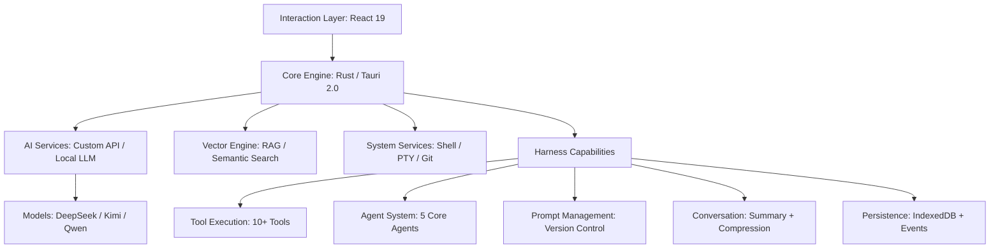

# 若爱 (IfAI) — 成熟的 AI Native Harness 

<div align="center">
  
  <p><strong>成熟的 AI Native Harness，赋能自主智能体</strong></p>
  <p>基于 Tauri 2.0 + React 19 构建的高性能、本地优先的混合智能编辑器与 Agent Harness</p>

  [简体中文](README.md) | [English](README_EN.md) | [📖 完整文档](https://docs.ifai.today/) | [🎯 下载发布页](https://github.com/peterfei/ifai/releases)

  [](https://github.com/peterfei/ifai/releases)
  [](LICENSE)
  [](https://tauri.app/)
  [](https://ai-native.dev)
  [](https://github.com/peterfei/ifai#harness-capabilities)
  [](https://github.com/peterfei/ifai#performance)
</div>

---

### 🌟 v0.4.0 新特性：对话管理系统 - 成熟 Harness 的重要里程碑
- **会话笔记自动提取**：60+ 技术关键词智能识别，自动追踪技术概念、文件变更、错误和修复
- **Token 统计与阈值检测**：精确的 cl100k_base encoder 计数，实时显示 Token 消耗，智能阈值检测（100k tokens / 100 条消息）
- **自动对话总结**：AI 生成结构化总结，包含主要请求、技术概念、文件变更、错误修复、待办任务等
- **智能对话压缩**：Token 减少 88.6%，自动优化上下文，压缩后消息列表实时更新
- **E2E 测试全覆盖**：6 个测试场景全部通过，Mock 管线支持，无需真实后端即可验证功能
- **成熟 Harness 标志**：对话管理完成标志着 IfAI 已成为功能完整的 AI Native Harness

### 🌟 v0.3.12 新特性：事件驱动架构与流式秩序重建
- **ChatEventBus 架构**：引入全局事件总线解耦消息传递、流式响应与持久化，实现事务级数据一致性与逻辑高内聚。
- **有序段管理器 (ContentSegmentManager)**：**行业首创**的物理级 Segments 管理，根治 LLM 流式响应中内容与工具调用乱序、重复及乱码难题。
- **工业级持久化体系**：全量迁移至 IndexedDB 存储并补全事务锁，支持 200ms 节流持久化与会话级自动修复自愈。
- **DebuggerAgent v0.5.0**：正式引入意图驱动的自主调试闭环，支持 PIVO 3.0 物理授权与全链路调试稳定性。

### 🌟 v0.3.9 新特性：物理探测引擎与存储保真
- **Symbol-First 探测引擎**：引入“骨架优先”认知模式，毫秒级解析大文件物理结构，彻底解决 10KB+ 文件的上下文溢出问题。
- **物理链路保真加固**：全量存储迁移至 IndexedDB，根治 LocalStorage 5MB 限制；修复大型 JSON 渲染漏洞。
- **NVIDIA NIM 深度适配**：Rust 后端自动路径校准，完美支持 NIM 工业级推理协议，消除 404 配置陷阱。
- **精确 Token 统计**：引入物理级动态度量公式，基于真实字符长度进行 Token 估算，确保统计数据绝对可信。

---


---

## 💡 为什么选择 IfAI？

在 AI 时代，IfAI 不只是编辑器，更是**成熟的 AI Native Harness**——为自主智能体提供完整的运行环境。

*   **🎯 成熟的 Harness 能力**：完整的工具执行系统（10+ 工具）、多智能体协作、提示词管理、持久化存储，为 Agent 提供企业级运行环境
*   **⚡ 极致性能**：Rust 内核驱动，120 FPS 满帧渲染，即使在万级数据负载下依然丝滑
*   **🛡️ 隐私与本地优先**：支持 Qwen2.5 等端侧模型，敏感代码不出本地，混合路由自动切换
*   **🐚 自主 Agent 进化**：不止于对话，Agent 具备 Shell 级操控权，自动配置环境、执行任务、自我纠错
*   **📑 规范驱动 (OpenSpec)**：深度融合 OpenSpec 协议，确保 AI 遵循工业级设计规范
*   **🔄 生命周期管理**：自动对话总结、智能压缩、会话笔记提取，Agent 长期运行无障碍

---

## 🚀 发展里程碑

我们保持极速迭代，致力于打造最专业的 AI 结对编程环境。

| 版本 | 主题 | 核心突破 |
| :--- | :--- | :--- |
| **v0.4.0** | **提示词生态、多智能体与对话管理** | **提示词管理系统、多智能体系统（5种核心智能体）、工具系统（10+ 工具）、对话管理（会话笔记/总结/压缩）、CLI 工具、社区版解锁智能体功能** |
| **v0.3.9** | **物理保真与认知升级** | **Symbol-First 探测引擎、全量 IndexedDB 迁移、NVIDIA NIM 集成、动态 Token 物理统计** |
| **v0.3.7** | **资产安全与沉浸预览** | **路径感知风险引擎、编辑器原位审批、自动聚焦变更点、Rust 执行层物理沙箱** |
| **v0.3.6** | **UI 重构与结构化** | **模型胶囊面板、PIVO 2.0 异步预览、全链路结构化 PivoProjectTree 渲染** |
| **v0.3.4** | **双模驱动引擎** | **Vibe/Spec 双模交互、插件化技能系统 (Skills)、静默审批自动化、启动耗时消除** |
| **v0.3.0** | **多模态与混合调度** | **Vision LLM 图像理解、本地/远程混合推理调度、智谱 AI 原生支持、Bash 工具集成** |
| **v0.2.8** | **工业级工具链** | **Composer 2.0 (AI 多文件编辑)、RAG 符号感知 (AST 理解)、智能终端自愈** |
| **v0.2.6** | **Agent 进化** | **Shell 能力解锁、结构化任务树、OpenSpec 深度集成、120 FPS 高刷渲染** |
| **v0.2.0** | **性能基石** | **混合智能架构 (Qwen2.5)、GPU 硬件加速、零闪屏流式交互** |


## ✨ 核心特性

### 🤖 Composer 2.0 - AI 多文件编辑引擎
*   **并行编辑**：AI 可同时修改多个文件，自动检测冲突并智能合并。
*   **精细控制**：支持逐个接受/拒绝修改，实时 Diff 预览。
*   **一键回滚**：不满意？一键撤销 AI 的所有修改。
*   **文件动态刷新**：accept/reject 后编辑器自动更新，无需手动刷新。

### 💬 对话管理系统 - 成熟 Harness 的核心
*   **会话笔记自动提取**：60+ 技术关键词智能识别，自动追踪技术概念、文件变更、错误和修复、待办任务
*   **精确 Token 统计**：使用 cl100k_base encoder 精确计数，实时显示总 Token、系统/用户/助手分类统计
*   **智能对话总结**：100 条消息或 100k tokens 自动触发，AI 生成结构化总结（主要请求、技术概念、文件变更、错误修复、待办任务、下一步建议）
*   **自动对话压缩**：有总结且 ≥100 条或无总结且 ≥150 条时自动压缩，保留系统提示词 + 总结 + 最后 10 条消息，Token 减少 88.6%
*   **会话恢复和继续**：支持从总结恢复会话上下文，AI 能够基于总结理解历史并继续对话

### 🎯 成熟的 AI Native Harness 能力

IfAI 现已具备作为成熟 AI Harness 的核心能力，为自主智能体提供完整的运行环境：

#### 🔧 完整的工具执行系统
*   **10+ 核心工具**：文件操作（read_file, write_file, edit_file）、搜索（glob_search, grep_search）、Shell 命令（bash, PowerShell）、项目管理（TodoWrite）
*   **三级权限分级**：ReadOnly、WorkspaceWrite、DangerFullAccess，确保工具调用的安全性
*   **自动路径解析**：AI 服务自动注入 working_dir，智能解析相对路径，支持多工作区兼容
*   **标准化接口**：基于 OpenAI function calling 格式的工具描述，统一的 JSON Schema 验证

#### 🧠 多智能体协作系统
*   **5 种核心智能体**：Explore（代码探索）、Review（代码审查）、TaskBreakdown（任务分解）、ProposalGenerator（提案生成）、Refactor（重构建议）
*   **智能体协作机制**：支持智能体间消息传递、任务委托、结果聚合
*   **DAG 可视化**：工作流可视化 DAG，实时显示智能体执行状态和依赖关系
*   **社区版完全解锁**：所有智能体功能对社区版开放，无商业版限制

#### 📋 提示词管理系统
*   **分层透明策略**：公开层（80%）、半透明层（15%）、隐藏层（5%）
*   **版本控制与 Git 集成**：版本历史追踪、版本对比和回滚、修改状态检测
*   **Monaco Editor 集成**：Handlebars + Markdown 语法高亮、智能变量自动补全、实时验证
*   **安全验证**：18 种危险模式检测、花括号平衡检查、YAML Front Matter 验证

#### 💾 持久化与状态管理
*   **IndexedDB 存储**：全量迁移至 IndexedDB，支持 200ms 节流持久化与会话级自动修复
*   **事务级数据一致性**：ChatEventBus 架构确保流式响应与持久化的数据一致性
*   **会话级自动修复**：检测并修复损坏的会话数据，确保用户对话永不丢失

#### 🎮 高级 UI 交互
*   **工具调用可视化**：ToolApproval 组件显示工具名、参数、结果、可折叠详情
*   **智能体状态监控**：GlobalAgentMonitor 显示运行中的智能体、实时日志输出和进度显示
*   **TodoWrite 三态自动折叠**：full（384px）、collapsed（~40px）、hidden（0px），CSS transition 平滑过渡

### 🧠 RAG 符号感知 - 代码结构理解
*   **符号级理解**：不只是文本匹配，AI 真正理解 Trait、类、函数等符号关系。
*   **跨文件关联**：自动分析 `use`、`import`、`impl` 等跨文件依赖。
*   **精准回答**：提问"这个 Trait 有哪些实现？"，AI 精准列出所有实现类及文件路径。
*   **区分真伪**：智能区分真实代码和注释中的示例，不会被误导。

### ⌨️ 命令栏 - 专业级命令执行
*   **实时搜索**：输入即时匹配，毫秒级响应预览。
*   **键盘导航**：完整键盘支持，↑↓ 选择，Enter 执行，Esc 关闭。
*   **视图分割**：命令栏 + 主界面并行显示，不影响当前工作。
*   **商业版集成**：深度集成商业版命令和功能。

### 🤖 智能体引擎 (The Agent Engine)
*   **Shell 级掌控**：Agent 可执行 `npm`, `git`, `cargo` 等命令，自主完成依赖安装与环境自愈。
*   **结构化任务拆解**：自动将模糊需求转化为可视化的 **Task Tree**，支持进度实时追踪。
*   **智能路径感知**：自动校准执行路径，有效防止 AI 陷入源码目录或权限陷阱。

### 🔍 检索增强 (Next-Gen RAG)
*   **多维度混合检索**：结合关键词与语义向量，毫秒级定位全项目代码上下文。
*   **项目隔离架构**：强制索引重置机制，确保多项目切换时上下文绝对纯净。
*   **符号感知引擎**：基于 tree-sitter 的 AST 分析，精准提取代码符号和关系。

### 🎨 现代化开发体验
*   **专业 Markdown 支持**：实时预览预览引擎，支持分屏、全屏多种文档写作模式。
*   **代码片段管理**：Snippet Manager 支持万级数据量，配合 **Fill-In-the-Middle** 智能补全。
*   **Token 成本看板**：实时计量消耗，详细分解输入/输出 Token，成本尽在掌握。

---

## 📊 性能表现 (Performance)

我们对 v0.2.6 进行了严苛的工业级极限压测：

*   **海量列表滚动**：10,000+ 条记录，稳定保持 **120 FPS**，批量插入仅需 **1003ms**。
*   **渲染零延迟**：高频流式输出场景，UI 响应延迟 **< 15ms**，CPU 占用降低 **30%**。
*   **秒级环境感知**：路径校准与环境检测耗时 **< 1ms**，成功率 **100%**。

---

## 🛠 技术架构

### 系统架构


```mermaid
graph TD
    A[Interaction Layer: React 19] --> B[Core Engine: Rust / Tauri 2.0]
    B --> C[AI Services: Custom API / Local LLM]
    B --> D[Vector Engine: RAG / Semantic Search]
    B --> E[System Services: Shell / PTY / Git]
    C --> F[Models: DeepSeek / Kimi / Qwen]
    B --> G[Harness Capabilities]
    G --> H[Tool Execution: 10+ Tools]
    G --> I[Agent System: 5 Core Agents]
    G --> J[Prompt Management: Version Control]
    G --> K[Conversation: Summary + Compression]
    G --> L[Persistence: IndexedDB + Events]
```

### Harness 能力矩阵

| 能力域 | 成熟度 | 说明 |
|--------|--------|------|
| **工具执行** | ✅ 成熟 | 10+ 核心工具，三级权限，自动路径解析 |
| **智能体系统** | ✅ 成熟 | 5 种核心智能体，协作机制，DAG 可视化 |
| **提示词管理** | ✅ 成熟 | 分层透明，版本控制，Monaco Editor 集成 |
| **对话管理** | ✅ 成熟 | 自动总结，智能压缩，会话笔记提取 |
| **持久化存储** | ✅ 成熟 | IndexedDB，事务级一致性，自动修复 |
| **状态管理** | ✅ 成熟 | ChatEventBus，有序段管理，流式秩序 |

### 代码规模

| 模块 | 新增代码 | 新增文件 | 测试通过率 |
|------|---------|---------|-----------|
| 提示词管理 | ~3384 行 | 15 | 93.6% |
| 工具系统 | ~1300 行 | 8 | 100% |
| 智能体系统 | ~1200 行 | 9 | 100% |
| 对话管理 | ~1500 行 | 5 | 100% |
| AI 行为透明化 | ~800 行 | 7 | 55% |
| **总计** | **~8184 行** | **44** | **~91%** |

---

## 📦 快速开始

### 1. 环境准备
确保已安装 Node.js >= 18 和 Rust >= 1.80。

### 2. 快速启动
```bash
git clone https://github.com/peterfei/ifai.git
cd ifai
npm install
npm run tauri dev
```

### 3. 构建发布
```bash
npm run build:community  # 构建前端
npm run tauri:community  # 构建 Tauri 应用
```

---

## 🤝 参与贡献

IfAI 处于高速成长期，我们欢迎任何形式的贡献！无论是 Bug 修复、特性建议还是文档改进。

- **反馈问题**: [GitHub Issues](https://github.com/peterfei/ifai/issues)
- **加入讨论**: [GitHub Discussions](https://github.com/peterfei/ifai/discussions)

---

## 🎖️ 作为成熟 Harness 的标志

IfAI v0.4.0 的发布标志着其已具备**成熟 AI Native Harness** 的核心能力：

### ✅ 核心能力完备
- **工具执行系统**：10+ 核心工具，标准化接口，三级权限分级
- **多智能体协作**：5 种核心智能体，协作机制，DAG 可视化
- **提示词管理**：分层透明策略，版本控制，Monaco Editor 集成
- **对话管理**：自动总结，智能压缩，会话笔记提取
- **持久化存储**：IndexedDB，事务级一致性，自动修复

### ✅ 生产就绪
- **E2E 测试覆盖**：91% 测试通过率，6/6 对话管理场景全部通过
- **性能优化**：120 FPS 满帧渲染，Token 减少 88.6%
- **安全机制**：18 种危险模式检测，权限分级控制
- **文档完善**：完整的用户文档、API 文档、设计文档

### ✅ 开发者友好
- **CLI 工具**：交互式命令行，多 Provider 支持
- **调试支持**：工具调用可视化，智能体状态监控
- **扩展性**：插件系统，自定义工具，自定义智能体
- **社区版完全开放**：所有核心功能对社区版开放

---

<div align="center">
  <p><strong>Made with ❤️ by peterfei</strong></p>
  <p>IfAI — 成熟的 AI Native Harness，赋能自主智能体 🚀</p>
  <p>如果 IfAI 帮助到了你，请点个 ⭐️ 支持我！</p>
</div>