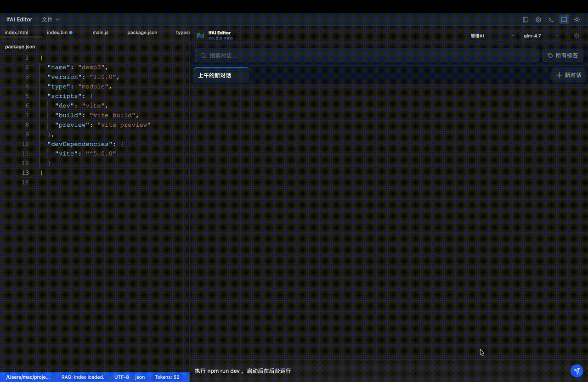
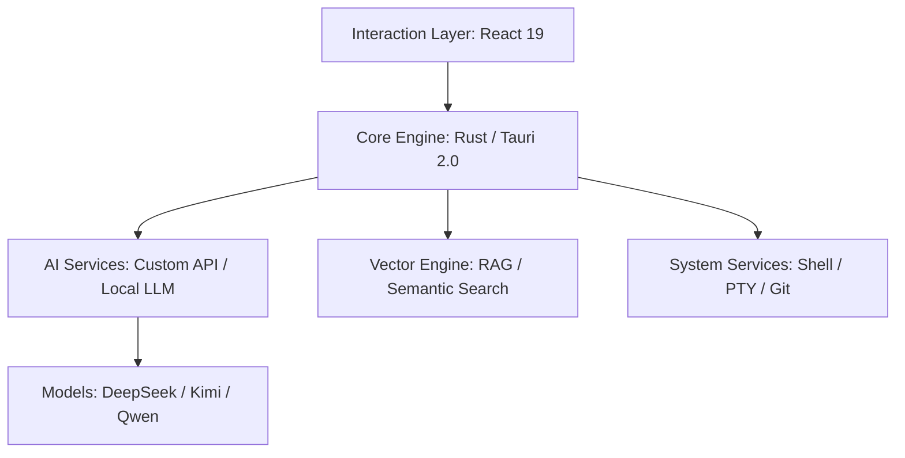

# 若爱 (IfAI) — AI 原生代码编辑器 🚀

<div align="center">
  
  <p><strong>不只是编辑器，更是你的自主编程伙伴</strong></p>
  <p>基于 Tauri 2.0 + React 19 构建的高性能、本地优先的混合智能编辑器</p>

  [简体中文](README.md) | [English](README_EN.md) | [📖 完整文档](https://docs.ifai.today/) | [🎯 下载发布页](https://github.com/peterfei/ifai/releases)

  [](https://github.com/peterfei/ifai/releases)
  [](LICENSE)
  [](https://tauri.app/)
  [](https://ai-native.dev)
  [](https://github.com/peterfei/ifai#performance)
</div>

---

### 🌟 v0.3.9 新特性：物理探测引擎与存储保真
- **Symbol-First 探测引擎**：引入“骨架优先”认知模式，毫秒级解析大文件物理结构，彻底解决 10KB+ 文件的上下文溢出问题。
- **物理链路保真加固**：全量存储迁移至 IndexedDB，根治 LocalStorage 5MB 限制；修复大型 JSON 渲染漏洞。
- **NVIDIA NIM 深度适配**：Rust 后端自动路径校准，完美支持 NIM 工业级推理协议，消除 404 配置陷阱。
- **精确 Token 统计**：引入物理级动态度量公式，基于真实字符长度进行 Token 估算，确保统计数据绝对可信。

---



---

## 💡 为什么选择 IfAI?

在 AI 时代，编辑器不应只是代码的容器，而应是 AI 的躯体。IfAI 采用 **AI 原生 (AI-Native)** 架构，将推理能力深度植入内核。

*   **⚡ 极致性能**：Rust 内核驱动，120 FPS 满帧渲染，即使在万级数据负载下依然丝滑。
*   **🛡️ 隐私与本地优先**：支持 Qwen2.5 等端侧模型，敏感代码不出本地，混合路由自动切换。
*   **🐚 自主 Agent 进化**：不止于对话，Agent 具备 Shell 级操控权，自动配置环境、执行任务、自我纠错。
*   **📑 规范驱动 (OpenSpec)**：深度融合 OpenSpec 协议，确保 AI 遵循工业级设计规范。

---

## 🚀 发展里程碑

我们保持极速迭代，致力于打造最专业的 AI 结对编程环境。

| 版本 | 主题 | 核心突破 |
| :--- | :--- | :--- |
| **v0.3.9** | **物理保真与认知升级** | **Symbol-First 探测引擎、全量 IndexedDB 迁移、NVIDIA NIM 集成、动态 Token 物理统计** |
| **v0.3.7** | **资产安全与沉浸预览** | **路径感知风险引擎、编辑器原位审批、自动聚焦变更点、Rust 执行层物理沙箱** |
| **v0.3.6** | **UI 重构与结构化** | **模型胶囊面板、PIVO 2.0 异步预览、全链路结构化 PivoProjectTree 渲染** |
| **v0.3.4** | **双模驱动引擎** | **Vibe/Spec 双模交互、插件化技能系统 (Skills)、静默审批自动化、启动耗时消除** |
| **v0.3.0** | **多模态与混合调度** | **Vision LLM 图像理解、本地/远程混合推理调度、智谱 AI 原生支持、Bash 工具集成** |
| **v0.2.8** | **工业级工具链** | **Composer 2.0 (AI 多文件编辑)、RAG 符号感知 (AST 理解)、智能终端自愈** |
| **v0.2.6** | **Agent 进化** | **Shell 能力解锁、结构化任务树、OpenSpec 深度集成、120 FPS 高刷渲染** |
| **v0.2.0** | **性能基石** | **混合智能架构 (Qwen2.5)、GPU 硬件加速、零闪屏流式交互** |


## ✨ 核心特性

### 🤖 Composer 2.0 - AI 多文件编辑引擎
*   **并行编辑**：AI 可同时修改多个文件，自动检测冲突并智能合并。
*   **精细控制**：支持逐个接受/拒绝修改，实时 Diff 预览。
*   **一键回滚**：不满意？一键撤销 AI 的所有修改。
*   **文件动态刷新**：accept/reject 后编辑器自动更新，无需手动刷新。

### 🧠 RAG 符号感知 - 代码结构理解
*   **符号级理解**：不只是文本匹配，AI 真正理解 Trait、类、函数等符号关系。
*   **跨文件关联**：自动分析 `use`、`import`、`impl` 等跨文件依赖。
*   **精准回答**：提问"这个 Trait 有哪些实现？"，AI 精准列出所有实现类及文件路径。
*   **区分真伪**：智能区分真实代码和注释中的示例，不会被误导。

### ⌨️ 命令栏 - 专业级命令执行
*   **实时搜索**：输入即时匹配，毫秒级响应预览。
*   **键盘导航**：完整键盘支持，↑↓ 选择，Enter 执行，Esc 关闭。
*   **视图分割**：命令栏 + 主界面并行显示，不影响当前工作。
*   **商业版集成**：深度集成商业版命令和功能。

### 🤖 智能体引擎 (The Agent Engine)
*   **Shell 级掌控**：Agent 可执行 `npm`, `git`, `cargo` 等命令，自主完成依赖安装与环境自愈。
*   **结构化任务拆解**：自动将模糊需求转化为可视化的 **Task Tree**，支持进度实时追踪。
*   **智能路径感知**：自动校准执行路径，有效防止 AI 陷入源码目录或权限陷阱。

### 🔍 检索增强 (Next-Gen RAG)
*   **多维度混合检索**：结合关键词与语义向量，毫秒级定位全项目代码上下文。
*   **项目隔离架构**：强制索引重置机制，确保多项目切换时上下文绝对纯净。
*   **符号感知引擎**：基于 tree-sitter 的 AST 分析，精准提取代码符号和关系。

### 🎨 现代化开发体验
*   **专业 Markdown 支持**：实时预览预览引擎，支持分屏、全屏多种文档写作模式。
*   **代码片段管理**：Snippet Manager 支持万级数据量，配合 **Fill-In-the-Middle** 智能补全。
*   **Token 成本看板**：实时计量消耗，详细分解输入/输出 Token，成本尽在掌握。

---

## 📊 性能表现 (Performance)

我们对 v0.2.6 进行了严苛的工业级极限压测：

*   **海量列表滚动**：10,000+ 条记录，稳定保持 **120 FPS**，批量插入仅需 **1003ms**。
*   **渲染零延迟**：高频流式输出场景，UI 响应延迟 **< 15ms**，CPU 占用降低 **30%**。
*   **秒级环境感知**：路径校准与环境检测耗时 **< 1ms**，成功率 **100%**。

---

## 🛠 技术架构


```mermaid
graph TD
    A[Interaction Layer: React 19] --> B[Core Engine: Rust / Tauri 2.0]
    B --> C[AI Services: Custom API / Local LLM]
    B --> D[Vector Engine: RAG / Semantic Search]
    B --> E[System Services: Shell / PTY / Git]
    C --> F[Models: DeepSeek / Kimi / Qwen]
```

---

## 📦 快速开始

### 1. 环境准备
确保已安装 Node.js >= 18 和 Rust >= 1.80。

### 2. 快速启动
```bash
git clone https://github.com/peterfei/ifai.git
cd ifai
npm install
npm run tauri dev
```

### 3. 构建发布
```bash
npm run build:community  # 构建前端
npm run tauri:community  # 构建 Tauri 应用
```

---

## 🤝 参与贡献

IfAI 处于高速成长期，我们欢迎任何形式的贡献！无论是 Bug 修复、特性建议还是文档改进。

- **反馈问题**: [GitHub Issues](https://github.com/peterfei/ifai/issues)
- **加入讨论**: [GitHub Discussions](https://github.com/peterfei/ifai/discussions)

---

<div align="center">
  <p><strong>Made with ❤️ by peterfei</strong></p>
  <p>如果 IfAI 帮助到了你，请点个 ⭐️ 支持我们！</p>
</div>