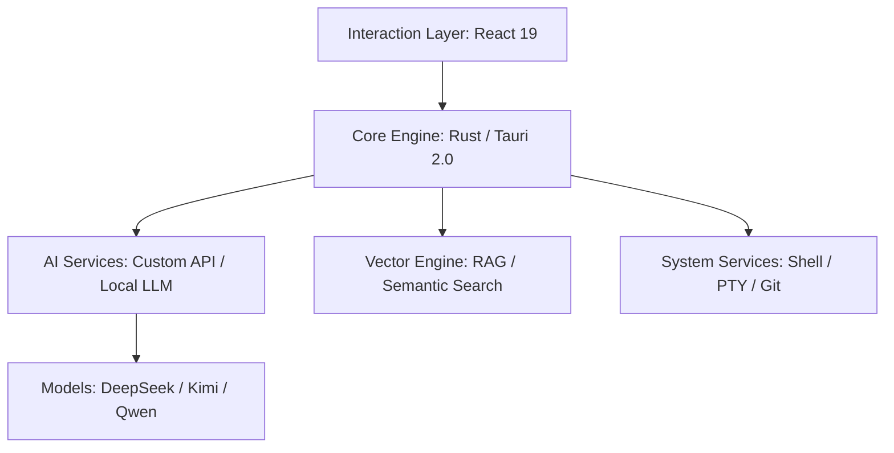

# IfAI — A Mature AI Native Harness 🚀

<div align="center">
  
  <p><strong>More than an editor, your autonomous programming partner</strong></p>
  <p>A high-performance, local-first hybrid intelligence editor built with Tauri 2.0 + React 19</p>

  [简体中文](README.md) | [English](README_EN.md) | [Русский](README_RU.md) | [📖 Full Documentation](https://docs.ifai.today/) | [🎯 Releases](https://github.com/peterfei/ifai/releases)

  [](https://github.com/peterfei/ifai/releases)
  [](LICENSE)
  [](https://tauri.app/)
  [](https://ai-native.dev)
  [](https://github.com/peterfei/ifai#performance)
</div>

---

### 🌟 v0.5.0 Highlights: Multi-Agent System Maturity + Intent Routing + TUI Markdown Rendering Engine

**I. 9 Dedicated Agents Fully Online ⭐ Core Highlight**
- **Refactor Agent** (`refactor_agent`): Code refactoring, completing existing AgentType
- **Git Commit Agent** (`git_commit_agent`): Smart commit — analyze changes → generate message → safe commit, 5-layer security (Pre-flight / Ghost Snapshot / Secret scanning / Commit Attribution / Blocklist)
- **Plan Agent** (`plan_agent`): Task decomposition and planning, auto-breakdown of complex requirements
- **ReAct Agent** (`react_agent`): Deep reasoning — explicit Thought → Action → Observation loop, with reflection and completion assessment
- **Review Agent Enhanced**: New `git_diff` / `complexity_analyzer` / `code_review` underlying tools
- **Test Agent** (`test_agent`): Automated test generation and execution
- **Doc Agent** (`doc_agent`): Automated documentation generation and maintenance
- **Debug Agent** (`debug_agent`): Smart debugging, auto error analysis and issue localization
- All Agents registered as safe tools (no approval needed)

**II. Declarative Intent Routing System 🔀**
- Declarative routing table replacing procedural if-else chains, O(1) lookup
- Say "refactor code" → auto-routes to `refactor_agent`, "commit code" → `git_commit_agent`
- Adding new Agents requires only one routing rule

**III. TUI Markdown Rendering Engine 🎨**
- **Dual-path rendering**: ANSI color/style preservation + Markdown markup cleanup (headers, tables, bold, italic, code)
- **Adaptive wrapping**: Narrow terminals no longer truncate content
- **State reset**: Auto-cleanup per conversation turn, no residue

**IV. Terminal Experience Improvements ⌨️**
- **Bracketed Paste Mode**: Pasting large text blocks no longer triggers per-character events
- **Auto-scroll fix**: Multi-line input content no longer hidden
- **SIGINT handler**: Ctrl+C safely exits TUI

**V. Security Fixes 🛡️**
- Fixed 9 UTF-8 string slicing out-of-bounds panics
- 1032 tests all passing (100%)

---

### 🌟 v0.4.8 Highlights: WebSearch Agent + Metaprogramming Architecture + 6x Performance Boost + **Qualitative Leap in Autonomous Conversations**

**I. Qualitative Leap in Autonomous Conversations 🤖⚡** ⭐ Core Highlight
- **100% Trust Model**: Completely removed loop blocking, circuit breaker, "plain text = stop" checks, fully trust AI autonomous decisions
- **Tool Call Explosion**: Limit increased from 100 → 1000 (**10x boost**), supports more complex multi-step tasks
- **Break Chain Issues Eradicated**: Fixed Agentic Loop break chains, infinite tool loop Continuing, HTTP 400 + break chain triple issues
- **Smart Compression System**: Integrated into AI service layer, prevents context overflow, Mid-turn compression failure fix, message pairing integrity guarantee
- **System Prompt Enhancement**: Autonomous tool calling reinforcement, Phase 1 system prompt optimization
- **Tool Call Progress Optimization**: Added target info (file paths/search patterns), fixed display timing issues

**II. WebSearch Agent 🌐**
- Integrated Bocha AI search engine, supporting real-time web search, latest tech documentation, and news queries
- Three-layer protection: System prompt enforcement (TUI + GUI), LLM tool list filtering (hides underlying web_search), auto-approval whitelist (category: safe)
- LRU in-memory cache + JSON persistence (~/.ifai/cache/search.json), TTL 1-hour expiration, <10ms response for cached queries

**III. #[derive(Tool)] Metaprogramming System 🔧**
- Zero boilerplate code using `#[derive(Tool)]` macro, auto-generates tool implementations and ToolLike trait
- MacroToolAdapter bridge pattern, seamless integration with legacy tool system, generic tool execution interface
- Completely replaces old FileToolsExecutor, YAML-based configuration-driven design

**IV. Explore Agent Performance Optimization 🚀**
- **6x Performance Boost**: GUI mode optimized from 79s to 13s (**83.7%** improvement)
- Removed agent_batch_read, switched to parallel agent_read_file + directory tree prescan, fully utilizes multi-core CPU
- Smart truncation of large files (prevents Token waste), tool call limits, real-time status bar feedback
- Removed file count limits, enhanced multi-round exploration, prompt multilingual fallback

**V. TUI First-Run Wizard 🎯**
- Smart setup wizard: Auto-detects first run, guides Provider configuration, Model and Base URL selection
- Provider metadata-driven: Removed all hardcoding, YAML configuration-driven, auto-loads Provider list, supports custom providers
- Declarative status bar animation system (metaprogramming): Declarative animation definitions, auto-generates rendering logic, zero hand-written animation code

**VI. Dedicated Agent Tools 🛠️**
- explore_agent & review_agent registered as low-risk tools (no approval needed), agent tool progress display optimized
- glob_search tool: Supports fuzzy file search, smart file filtering, high-performance search

**VII. Prompt Reference Resolution 📝**
- Custom prompt support: Prompt reference resolution, user custom prompt priority loading, minimal deployment support
- Externalized templates: Externalized prompt templates, supports hot reload, no recompilation needed

---

### 🌟 v0.4.7 Highlights: Persistent Memory System — Let AI Remember You Across Sessions
- **Persistent Memory System**: Zero-dependency pure Markdown storage, two-layer memory architecture (hot memory injection into system prompt + cold memory session archiving), spatial metaphor organization (Wing → Hall → Room three-layer paths), 18μs injection latency
- **MemorySave Tool**: AI proactively saves user preferences, technical decisions, project knowledge during conversations, auto-executed without approval, automatic deduplication prevents duplicate entries
- **Post-Session Batch Extraction**: LLM-driven intelligent memory extraction, automatically mines information worth remembering from conversations, externalized prompt templates support customization (`~/.ifai/prompts/memory/extract.md`)
- **Session Archiving (Cold Memory)**: TUI session end auto-generates summary archives to `~/.ifai/sessions/`, human-browsable Markdown format
- **Smart Compression System**: Tool output truncation + model-aware thresholds + AI summarization, solves long conversation Token explosion
- **TUI + GUI Memory Sharing**: Same `~/.ifai/memories.md` file, seamless cross-interface usage
- **10 Bug Fixes**: Overlay content leakage, Agentic Loop spinning, Ctrl+O/Ctrl+D black screen, TodoWrite occlusion/break chains, LLM connection timeout no feedback

---

### 🌟 v0.4.6 Highlights: Multi-Thread Concurrent Chat & TUI Architecture Refactor
- **Multi-Thread Concurrent Chat System**: Per-Thread Session isolation with concurrent AI requests, Arc<Mutex> 3-stage lock strategy, ThreadEvent type-safe routing, concurrent streaming + approval isolation
- **/thread Slash Commands**: `/thread new`, `/thread list`, `/thread switch <id>`, `/thread close` with thread mode popup rendering
- **Multi-line Input**: Shift+Enter/Alt+Enter/Ctrl+J for line breaks, smart auto-scroll, focus restore fix
- **TUI God Object Refactor Phase 1-4**: App struct 27→14 fields (5 subsystems extracted), Mode enum replacing 5 boolean flags, declarative routing table (handle_single_key_event 238→158 lines), unified StreamState cleanup
- **14-Round Context Break E2E Tests**: Including 2048 game generation, concurrent approval tests, cross-thread isolation tests, streaming leak tests; total tests 830→862
- **10 Bug Fixes**: Shortcut blocking, scroll failure, streaming mouse wheel, keyboard event loss, message loss, cross-thread crosstalk, multi-line scroll overflow

---


---

## 💡 Why Choose IfAI?

In the AI era, editors should be more than code containers—they should be the body of AI. IfAI adopts an **AI-Native** architecture, deeply implanting reasoning capabilities into its core.

*   **⚡ Extreme Performance**: Rust kernel driven, 120 FPS smooth rendering even under 10k+ data loads
*   **🛡️ Privacy & Local-First**: Supports Qwen2.5 and other on-device models, sensitive code never leaves locally, hybrid routing automatic switching
*   **🐚 Autonomous Agent Evolution**: Beyond conversation, Agents have Shell-level control, automatically configure environments, execute tasks, self-correct
*   **📑 Specification-Driven (OpenSpec)**: Deep OpenSpec protocol integration ensures AI follows industrial-grade design specifications

---

## 🚀 Development Milestones

We maintain rapid iteration, committed to building the most professional AI pair programming environment.

| Version | Theme | Core Breakthroughs |
| :--- | :--- | :--- |
| **v0.5.0** | **Multi-Agent System Maturity + Intent Routing + TUI Rendering** | **9 dedicated Agents (Refactor/Git Commit/Plan/ReAct/Review/Test/Doc/Debug/Explore), declarative intent routing (O(1) lookup), TUI Markdown rendering engine (dual-path + adaptive wrapping), Bracketed Paste Mode, SIGINT safe exit, 1032 tests passing** |
| **v0.4.8** | **Autonomous Conversation Leap + WebSearch + Metaprogramming + Performance** | **100% trust model (tool limits 100→1000, 10x boost), eradicated break chain issues (Agentic Loop + infinite Continuing + HTTP 400), smart compression system (integrated into AI service layer + Mid-turn fix), Bocha AI integration (three-layer protection + LRU cache), #[derive(Tool)] metaprogramming (zero boilerplate), Explore performance optimization (79s→13s, 6x boost), TUI first-run wizard, declarative status bar animation, dedicated Agent tools, prompt reference resolution** |
| **v0.4.7** | **Persistent Memory System** | **Zero-dependency pure Markdown two-layer memory (hot injection + cold archiving), MemorySave tool (AI proactive save + auto dedup), LLM batch extraction, externalized prompts, 18μs injection latency, session archiving, smart compression, TUI+GUI sharing, 10 bug fixes** |
| **v0.4.6** | **Multi-Thread Concurrent Chat & TUI Refactor** | **Per-Thread Session isolation (concurrent streaming + approval isolation), /thread slash commands, multi-line input (Shift+Enter), TUI God Object refactor Phase 1-4 (App 27→14 fields, Mode enum, declarative routing, StreamState unified cleanup), 862 tests, 10 bug fixes** |
| **v0.4.5** | **TUI Enhancement & Testing Framework** | **Ctrl+O Detail View Overlay (fullscreen view), Ctrl+D Diff Mode (toggle switch), input message queue (streaming queuing), slash command popup (metaprogramming), 510+ tests (parametric/parallel/snapshot/E2E), metaprogramming architecture, 10 bug fixes** |
| **v0.4.4** | **CLI Overhaul — Industrial Terminal AI Assistant** | **Metadata-driven CLI architecture, metaprogramming permission engine, Token system, TOML configuration, session persistence, Pipeline visualization, loop detection engine, ratatui fullscreen TUI, smart Glob search, 49 tests** |
| **v0.4.3** | **Metadata-Driven Architecture & Internationalization** | **Metadata-driven Provider architecture (YAML config), 5 AI providers 80+ models, complete multimodal support, three-language coverage (CN/EN/RU), CI integration & quality gates, SSE stream parsing fix** |
| **v0.4.2** | **Skill Center Refactor & Streaming Performance** | **Skill Center Phase 7 full refactor, BatchEventStream optimization, tool call race fix, E2E test framework v2.0, 10 bug fixes** |
| **v0.4.1** | **Multi-Agent Collaboration & Message Stability** | **Multi-agent collaboration system (P0-P4 complete), DAG workflow engine, agent communication protocol, message queue system, Tab message isolation, 12 bug fixes** |
| **v0.4.0** | **Prompt Ecosystem & Multi-Agent** | **Prompt management system, multi-agent system (Explore/Review/TaskBreakdown/ProposalGenerator/Refactor), tool system (10+ tools), CLI tool, community edition unlocks agent features** |
| **v0.3.9** | **Physical Fidelity & Cognitive Upgrade** | **Symbol-First probing engine, full IndexedDB migration, NVIDIA NIM integration, dynamic Token physical statistics** |
| **v0.3.7** | **Asset Security & Immersive Preview** | **Path-aware risk engine, editor in-place approval, auto-focus change points, Rust execution layer physical sandbox** |
| **v0.3.6** | **UI Refactor & Structuring** | **Model capsule panel, PIVO 2.0 async preview, full-chain structured PivoProjectTree rendering** |
| **v0.3.4** | **Dual-Mode Drive Engine** | **Vibe/Spec dual-mode interaction, pluginized skill system (Skills), silent approval automation, startup time elimination** |
| **v0.3.0** | **Multimodal & Hybrid Scheduling** | **Vision LLM image understanding, local/remote hybrid inference scheduling, Zhipu AI native support, Bash tool integration** |
| **v0.2.8** | **Industrial Toolchain** | **Composer 2.0 (AI multi-file editing), RAG symbol-aware (AST understanding), smart terminal self-healing** |
| **v0.2.6** | **Agent Evolution** | **Shell capability unlock, structured task tree, OpenSpec deep integration, 120 FPS high-refresh rendering** |
| **v0.2.0** | **Performance Foundation** | **Hybrid intelligence architecture (Qwen2.5), GPU hardware acceleration, zero-flicker streaming interaction** |

---

## ✨ Core Features

### 🤖 Composer 2.0 - AI Multi-File Editing Engine
*   **Parallel Editing**: AI can modify multiple files simultaneously, automatically detecting conflicts and intelligently merging
*   **Fine-grained Control**: Support accepting/rejecting modifications individually, real-time Diff preview
*   **One-Click Rollback**: Not satisfied? One-click undo all AI modifications
*   **Dynamic File Refresh**: Editor automatically updates after accept/reject, no manual refresh needed

### 🧠 RAG Symbol-Aware - Code Structure Understanding
*   **Symbol-Level Understanding**: Not just text matching, AI truly understands relationships between Traits, classes, functions
*   **Cross-File Association**: Automatically analyzes cross-file dependencies like `use`, `import`, `impl`
*   **Precise Answers**: Ask "What implementations does this Trait have?", AI accurately lists all implementation classes and file paths
*   **Distinguish Real from Fake**: Intelligently distinguishes real code from examples in comments, won't be misled

### ⌨️ Command Bar - Professional Command Execution
*   **Real-time Search**: Instant matching as you type, millisecond-level response preview
*   **Keyboard Navigation**: Complete keyboard support, ↑↓ select, Enter execute, Esc close
*   **View Splitting**: Command bar + main interface display in parallel, doesn't affect current work
*   **Commercial Edition Integration**: Deeply integrated with commercial edition commands and features

### 🤖 The Agent Engine
*   **Shell-Level Control**: Agent can execute `npm`, `git`, `cargo` and other commands, autonomously completing dependency installation and environment self-healing
*   **Structured Task Breakdown**: Automatically converts vague requirements into visualized **Task Tree**, supports real-time progress tracking
*   **Smart Path Awareness**: Automatically calibrates execution paths, effectively preventing AI from falling into source directory or permission traps

### 🔍 Next-Gen RAG (Retrieval-Augmented Generation)
*   **Multi-Dimensional Hybrid Retrieval**: Combines keywords with semantic vectors, millisecond-level positioning of full-project code context
*   **Project Isolation Architecture**: Forced index reset mechanism ensures absolute context purity when switching between multiple projects
*   **Symbol-Aware Engine**: tree-sitter based AST analysis, precisely extracts code symbols and relationships

### 🎨 Modern Development Experience
*   **Professional Markdown Support**: Real-time preview rendering engine, supports split-screen, fullscreen document writing modes
*   **Code Snippet Management**: Snippet Manager supports 10k-level data volume, with **Fill-In-the-Middle** intelligent completion
*   **Token Cost Dashboard**: Real-time consumption metering, detailed breakdown of input/output tokens, costs under control

---

## 📊 Performance (Performance)

We conducted rigorous industrial-grade extreme stress testing on v0.2.6:

*   **Massive List Scrolling**: 10,000+ records, stably maintains **120 FPS**, batch insertion only **1003ms**
*   **Zero-Lag Rendering**: High-frequency streaming output scenarios, UI response delay **< 15ms**, CPU usage reduced **30%**
*   **Second-Grade Environment Awareness**: Path calibration and environment detection takes **< 1ms**, success rate **100%**

---

## 🏗 Technical Architecture



---

## 🦶 Quick Start

### 1. Environment Preparation
Ensure Node.js >= 18 and Rust >= 1.80 are installed.

### 2. Quick Launch
```bash
git clone https://github.com/peterfei/ifai.git
cd ifai
npm install
npm run tauri dev
```

### 3. Build Release
```bash
npm run build:community  # Build frontend
npm run tauri:community  # Build Tauri app
```

---

## 🤝 Contributing

IfAI is in a high-growth phase, we welcome any form of contribution! Whether it's bug fixes, feature suggestions, or documentation improvements.

- **Report Issues**: [GitHub Issues](https://github.com/peterfei/ifai/issues)
- **Join Discussion**: [GitHub Discussions](https://github.com/peterfei/ifai/discussions)

---

<div align="center">
  <p><strong>Made with ❤️ by peterfei</strong></p>
  <p>If IfAI helps you, please give us a ⭐️ to support me!</p>
</div>
