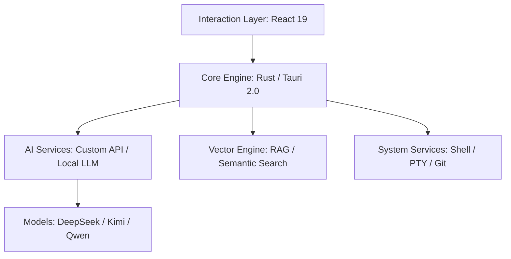

# IfAI — Зрелая AI-Native платформа 🚀

<div align="center">
  
  <p><strong>Больше чем редактор, ваш автономный партнёр по программированию</strong></p>
  <p>Высокопроизводительный, локально-ориентированный гибридный интеллект на Tauri 2.0 + React 19</p>

  [简体中文](README.md) | [English](README_EN.md) | [Русский](README_RU.md) | [📖 Полная документация](https://docs.ifai.today/) | [🎯 Релизы](https://github.com/peterfei/ifai/releases)

  [](https://github.com/peterfei/ifai/releases)
  [](LICENSE)
  [](https://tauri.app/)
  [](https://ai-native.dev)
  [](https://github.com/peterfei/ifai#performance)
</div>

---

### 🌟 v0.5.1 Новые возможности: Оркестрация агентного сотрудничества + Движок сохранения сессий + Улучшения терминала

**I. Система оркестрации агентного сотрудничества ⭐ Ключевой момент**
- **Инфраструктура метапрограммирования**: Макросы определения протокола сообщений + `workflow!` DSL макрос, нулевой шаблонный код для определения потоков сотрудничества агентов
- **Взаимные вызовы агентов + Параллельное выполнение**: Инструмент `call_agent_parallel`, поддержка параллельного выполнения задач несколькими агентами
- **Условное выполнение JSONPath**: Узлы рабочего процесса поддерживают условное ветвление на основе JSONPath
- **Система разрешений**: Тонкий контроль разрешений для инструментов сотрудничества, условная компиляция community/commercial

**II. Движок сохранения и восстановления сессий 💾**
- **JSONL журнал только для добавления**: Инкрементальный журнал событий в `~/.ifai/sessions/live/`
- **Модель WAL + Checkpoint**: JSONL (инкрементальный журнал) + Auto Snapshot (периодический контрольный снимок) двухпутевая отказоустойчивость
- **Повтор истории сообщений**: При возобновлении исторические сообщения автоматически записываются в JSONL, делая JSONL единственным источником истины
- **Интерактивный ResumePicker**: Команда `/resume` открывает визуальный селектор восстановления с поддержкой auto snapshot / live JSONL / saved session
- **Очистка сессий**: Автоархивирование инкрементальных журналов + очистка устаревших снимков при выходе
- **Индикатор сохранения событий**: Нижняя панель TUI показывает `evt:N` счётчик событий в реальном времени

**III. Улучшения терминала ⌨️**
- **Адаптация к изменению размера терминала**: Обработка изменений размера окна, устранение артефактов
- **Двойной Ctrl+C принудительный выход**: Первый Ctrl+C показывает дружественную подсказку, второй принудительно выходит с асинхронным сохранением сессии
- **Оптимизация кэша файлов**: Параллельные агенты разделяют чтение файлов, уменьшение дублирования I/O

**IV. Исправления ошибок 🛡️**
- Исправлена поддержка потоковых tool_calls для OpenAI-совместимого API и ошибки 401
- Исправлено соответствие коротких имён в конфигурации TOML provider, предупреждение об отсутствующем api_key
- Исправлена фильтрация эха вызовов инструментов и отображение вывода

---

### 🌟 v0.5.0 Новые возможности: Зрелая мультиагентная система + Маршрутизация намерений + TUI Markdown движок рендеринга

**I. 9 специализированных агентов в строю ⭐ Ключевой момент**
- **Refactor Agent** (`refactor_agent`): Рефакторинг кода, дополнение существующего AgentType
- **Git Commit Agent** (`git_commit_agent`): Умный коммит — анализ изменений → генерация сообщения → безопасный коммит, 5-уровневая безопасность (Pre-flight / Ghost Snapshot / сканирование секретов / Commit Attribution / стоп-лист)
- **Plan Agent** (`plan_agent`): Декомпозиция задач и планирование, автоматическая разбивка сложных требований
- **ReAct Agent** (`react_agent`): Глубокие рассуждения — явный цикл Thought → Action → Observation с механизмом рефлексии и оценкой завершённости
- **Review Agent усилен**: Новые базовые инструменты `git_diff` / `complexity_analyzer` / `code_review`
- **Test Agent** (`test_agent`): Автоматическая генерация и выполнение тестов
- **Doc Agent** (`doc_agent`): Автоматическая генерация и обслуживание документации
- **Debug Agent** (`debug_agent`): Умная отладка, автоматический анализ ошибок и локализация проблем
- Все агенты зарегистрированы как безопасные инструменты (без одобрения)

**II. Декларативная система маршрутизации намерений 🔀**
- Декларативная таблица маршрутизации заменяет процедурные цепочки if-else, O(1) поиск
- Скажите «рефакторинг кода» → автоматически маршрутизируется в `refactor_agent`, «закоммитить код» → `git_commit_agent`
- Добавление нового агента требует только одного правила маршрутизации

**III. TUI Markdown движок рендеринга 🎨**
- **Двухпутевой рендеринг**: Сохранение ANSI цветов/стилей + очистка разметки Markdown (заголовки, таблицы, жирный, курсив, код)
- **Адаптивный перенос**: Узкие терминалы больше не обрезают контент
- **Сброс состояния**: Автоочистка каждый ход диалога, без остатка

**IV. Улучшения терминального опыта ⌨️**
- **Bracketed Paste Mode**: Вставка больших блоков текста больше не вызывает посимвольные события
- **Исправление автопрокрутки**: Контент многострочного ввода больше не скрывается
- **Обработчик SIGINT**: Ctrl+C безопасно выходит из TUI

**V. Исправления безопасности 🛡️**
- Исправлено 9 panic при небезопасной нарезке UTF-8 строк
- 1032 теста пройдены (100%)

---

### 🌟 v0.4.8 Новые возможности: WebSearch Agent + Метапрограммная архитектура + 6-кратное ускорение + **Качественный скачок в автономных диалогах**

**I. Качественный скачок в автономных диалогах 🤖⚡** ⭐ Ключевой момент
- **100% Доверительная модель**: Полностью удалены блокировка циклов, предохранители, проверки "обычный текст = стоп", полное доверие AI автономным решениям
- **Взрывное увеличение вызовов инструментов**: Лимит увеличен с 100 → 1000 (**10-кратный буст**), поддерживает более сложные многошаговые задачи
- **Проблемы разрыва цепочек искоренены**: Исправлены разрывы цепочек Agentic Loop, бесконечное продолжение циклов инструментов, тройные проблемы HTTP 400 + разрыв цепочек
- **Умная система сжатия**: Интегрирована в слой AI сервисов, предотвращает переполнение контекста, исправление отказа Mid-turn сжатия, гарантия целостности паринга сообщений
- **Усиление системных промптов**: Усиление автономного вызова инструментов, оптимизация системных промптов Phase 1
- **Оптимизация прогресса вызовов инструментов**: Добавлена целевая информация (пути файлов/шаблоны поиска), исправлены проблемы времени отображения

**II. WebSearch Agent 🌐**
- Интегрирована поисковая система Bocha AI, поддерживающая поиск в реальном времени, последнюю техническую документацию и новостные запросы
- Трёхуровневая защита: Обязательные правила системных промптов (TUI + GUI), фильтрация списка инструментов LLM (скрывает базовый web_search), белый список авто-одобрения (category: safe)
- LRU кэш в памяти + JSON персистентность (~/.ifai/cache/search.json), TTL 1 час, <10мс ответ для кэшированных запросов

**III. Метапрограммная система #[derive(Tool)] 🔧**
- Нулевой шаблонный код с использованием макроса `#[derive(Tool)]`, автогенерация реализации инструментов и ToolLike trait
- Шаблон адаптера MacroToolAdapter, бесшовная интеграция с устаревшей системой инструментов, универсальный интерфейс выполнения
- Полностью заменяет старый FileToolsExecutor, дизайн на основе конфигурации YAML

**IV. Оптимизация производительности Explore Agent 🚀**
- **6-кратное ускорение**: Режим GUI оптимизирован с 79s до 13s (**улучшение на 83.7%**)
- Удалён agent_batch_read, переключен на параллельный agent_read_file + предсканирование дерева каталогов, полное использование многоядерного CPU
- Умная усечение больших файлов (предотвращает waste Token), ограничения вызовов инструментов, обратная связь статус-бара в реальном времени
- Удалены ограничения количества файлов, усилено многоуровневое исследование, многоязычный откат промптов

**V. Мастер первого запуска TUI 🎯**
- Умный мастер настройки: Автоопределение первого запуска, руководство конфигурацией Provider, выбор Model и Base URL
- На основе метаданных Provider: Удалены все жёстко запрограммированные значения, на основе конфигурации YAML, автозагрузка списка Provider, поддержка кастомных Provider
- Декларативная система анимации статус-бара (метапрограммирование): Декларативные определения анимации, автогенерация логики рендеринга, ноль вручную написанного кода анимации

**VI. Специализированные инструменты Agent 🛠️**
- explore_agent & review_agent зарегистрированы как инструменты низкого риска (одобрение не нужно), оптимизирован индикатор прогресса инструментов agent
- glob_search инструмент: Поддерживает нечёткий поиск файлов, умную фильтрацию файлов, высокопроизводительный поиск

**VII. Разрешение ссылок промптов 📝**
- Поддержка кастомных промптов: Разрешение ссылок промптов, приоритетная загрузка пользовательских кастомных промптов, поддержка минимального развёртывания
- Внешние шаблоны: Внешние шаблоны промптов, поддержка горячей перезагрузки, перекомпиляция не нужна

---

### 🌟 v0.4.7 Новые возможности: Система постоянной памяти — Пусть AI запоминает вас между сессиями
- **Система постоянной памяти**: Хранение чистого Markdown без зависимостей, двухуровневая архитектура памяти (горячая инъекция в системный промпт + холодное архивирование сессий), пространственная метафора (Wing → Hall → Room трёхуровневые пути), задержка инъекции 18мкс
- **Инструмент MemorySave**: AI проактивно сохраняет предпочтения пользователя, технические решения, знания о проекте во время разговоров, авто-выполнение без одобрения, автоматическая дедупликация предотвращает дубликаты
- **Пакетное извлечение после сессии**: Интеллектуальное извлечение памяти на основе LLM, автоматический поиск информации, достойной запоминания, из разговоров, внешние шаблоны промптов поддерживают кастомизацию (`~/.ifai/prompts/memory/extract.md`)
- **Архивирование сессий (холодная память)**: Автоматическая генерация сводок при завершении TUI сессии в `~/.ifai/sessions/`, читаемый человеком формат Markdown
- **Система умного сжатия**: Обрезка вывода инструментов + пороги осведомлённости о модели + AI-саммаризация, решает проблему взрыва токенов в длинных разговорах
- **Совместимость TUI + GUI памяти**: Один файл `~/.ifai/memories.md`, бесшовное использование между интерфейсами
- **10 исправлений багов**: Утечка содержимого оверлея, зацикливание Agentic Loop, чёрный экран Ctrl+O/Ctrl+D, перекрытие TodoWrite/разрыв цепочек, отсутствие обратной связи при тайм-ауте подключения LLM

---

### 🌟 v0.4.6 Новые возможности: Многопоточная система параллельных разговоров & Рефакторинг архитектуры TUI
- **Многопоточная параллельная система чата**: Изоляция сессий на поток, параллельные AI-запросы, стратегия трёхфазной блокировки Arc<Mutex>, типобезопасная маршрутизация ThreadEvent, изоляция потокового стриминга + одобрения
- **Слеш-команды /thread**: `/thread new`, `/thread list`, `/thread switch <id>`, `/thread close` с всплывающим рендерингом режима потока
- **Многострочный ввод**: Shift+Enter/Alt+Enter/Ctrl+J для переносов строк, умная автопрокрутка, исправление восстановления фокуса
- **Рефакторинг TUI God Object Фаза 1-4**: Структура App 27→14 полей (5 извлечённых подсистем), enum Mode заменяет 5 булевых флагов, декларативная таблица маршрутизации (handle_single_key_event 238→158 строк), унифицированная очистка StreamState
- **E2E тесты 14 раундов разрыва контекста**: Включая генерацию игры 2048, тесты параллельного одобрения, тесты изоляции межпоточной связи, тесты утечки стриминга; всего тестов 830→862
- **10 исправлений багов**: Блокировка горячих клавиш, отказ прокрутки, мышеловок стриминга, потеря событий клавиатуры, потеря сообщений, межпоточные перекрёстки, переполнение прокрутки многострочного ввода

---


---

## 💡 Почему выбирают IfAI?

В эру AI редакторы должны быть больше, чем контейнерами кода — они должны быть телом AI. IfAI принимает архитектуру **AI-Native**, глубоко внедряя возможности вывода в своё ядро.

*   **⚡ Экстремальная производительность**: Драйвер ядра Rust, 120 FPS плавная отрисовка даже под нагрузкой 10k+ данных
*   **🛡️ Приватность и локальная ориентация**: Поддержка Qwen2.5 и других локальных моделей, чувствительный код не покидает локально, гибридная маршрутизация автоматическое переключение
*   **🐚 Эволюция автономных агентов**: Не просто разговор, агенты имеют контроль уровня Shell, автоматически настраивают окружение, выполняют задачи, самокорректируются
*   **📑 Спецификация-ориентированный (OpenSpec)**: Глубокая интеграция протокола OpenSpec гарантирует, что AI следует промышленным спецификациям дизайна

---

## 🚀 Вехи развития

Мы поддерживаем быструю итерацию, стремясь создать самую профессиональную среду AI pair-программирования.

| Версия | Тема | Основные прорывы |
| :--- | :--- | :--- |
| **v0.5.1** | **Оркестрация агентного сотрудничества + Движок сохранения сессий** | **Инфраструктура метапрограммирования (макросы протокола сообщений + workflow! DSL), взаимные вызовы агентов + параллельное выполнение (call_agent_parallel), условное выполнение JSONPath, JSONL журнал только для добавления + Auto Snapshot (WAL + Checkpoint), повтор истории в JSONL (единый источник истины), интерактивный ResumePicker, очистка и архивирование сессий, индикатор сохранения событий, адаптация к изменению размера терминала, двойной Ctrl+C выход, исправление потоковых tool_calls OpenAI** |
| **v0.5.0** | **Зрелая мультиагентная система + Маршрутизация + TUI рендеринг** | **9 специализированных агентов (Refactor/Git Commit/Plan/ReAct/Review/Test/Doc/Debug/Explore), декларативная маршрутизация намерений (O(1) поиск), TUI Markdown движок рендеринга (двухпутевой + адаптивный перенос), Bracketed Paste Mode, безопасный выход SIGINT, 1032 теста пройдены** |
| **v0.4.8** | **Скачок в автономных диалогах + WebSearch + Метапрограммирование + Производительность** | **100% доверительная модель (лимит инструментов 100→1000, 10-кратный буст), искоренение проблем разрыва цепочек (Agentic Loop + бесконечное Continuing + HTTP 400), умная система сжатия (интегрирована в слой AI сервисов + исправление Mid-turn), интеграция Bocha AI (трёхуровневая защита + LRU кэш), метапрограммная система #[derive(Tool)] (ноль шаблонного кода), оптимизация производительности Explore (79s→13s, 6-кратное ускорение), мастер первого запуска TUI, декларативная анимация статус-бара, специализированные инструменты Agent, разрешение ссылок промптов** |
| **v0.4.7** | **Система постоянной памяти** | **Двухуровневая память чистого Markdown без зависимостей (горячая инъекция + холодное архивирование), инструмент MemorySave (AI проактивное сохранение + авто дедупликация), LLM пакетное извлечение, внешние промпты, задержка инъекции 18мкс, архивирование сессий, умное сжатие, совместимость TUI+GUI, 10 исправлений** |
| **v0.4.6** | **Многопоточная система чата & Рефакторинг TUI** | **Изоляция Per-Thread Session (параллельный стриминг + изоляция одобрения), слеш-команды /thread, многострочный ввод (Shift+Enter), рефакторинг TUI God Object Фаза 1-4 (App 27→14 полей, Mode enum, декларативная маршрутизация, унифицированная очистка StreamState), 862 теста, 10 исправлений** |
| **v0.4.5** | **Улучшение TUI & Тестовый фреймворк** | **Ctrl+O Detail View Overlay (полноэкранный просмотр), Ctrl+D Diff Mode (переключатель), очередь входящих сообщений (прокручивание во время стриминга), всплывающее окно слеш-команд (метапрограммирование), 510+ тестов (параметрические/параллельные/снапшоты/E2E), метапрограммная архитектура, 10 исправлений** |
| **v0.4.4** | **Переработка CLI — Промышленный терминальный AI-ассистент** | **Метадата-ориентированная архитектура CLI, метапрограммный движок разрешений, система токенов, конфигурация TOML, персистентность сессий, визуализация Pipeline, движок обнаружения циклов, полноэкранный TUI ratatui, умный Glob поиск, 49 тестов** |
| **v0.4.3** | **Метадата-ориентированная архитектура и интернационализация** | **Метадата-ориентированная архитектура Provider (конфиг YAML), 5 AI-провайдеров 80+ моделей, полная мультимодальная поддержка, трёхуровневая языковая поддержка (CN/EN/RU), CI-интеграция и ворота качества, исправление парсинга SSE-стрима** |
| **v0.4.2** | **Рефакторинг центра навыков & Производительность стриминга** | **Полный рефакторинг центра навыков Фаза 7, оптимизация BatchEventStream, исправление гонки вызовов инструментов, E2E тестовый фреймворк v2.0, 10 исправлений** |
| **v0.4.1** | **Мультиагентная кооперация & Стабильность сообщений** | **Система мультиагентной кооперации (P0-P4 завершено), движок DAG-воркфлоу, протокол коммуникации агентов, система очереди сообщений, изоляция сообщений вкладок, 12 исправлений** |
| **v0.4.0** | **Экосистема промптов и мультиагенты** | **Система управления промптами, мультиагентная система (Explore/Review/TaskBreakdown/ProposalGenerator/Refactor), система инструментов (10+ инструментов), инструмент CLI, сообщественное издание разблокирует функции агентов** |
| **v0.3.9** | **Физическая точность и Когнитивное обновление** | **Движок зондирования Symbol-First, полный перенос в IndexedDB, интеграция NVIDIA NIM, физическая статистика динамических токенов** |
| **v0.3.7** | **Безопасность активов и Погружаемый превью** | **Движок осведомлённости о пути, одобрение на месте редактора, автофокус точек изменения, физический песочный слой выполнения Rust** |
| **v0.3.6** | **Рефакторинг UI и Структурирование** | **Панель капсулы модели, асинхронный превью PIVO 2.0, рендеринг полной цепочки структурированных PivoProjectTree** |
| **v0.3.4** | **Двухрежимный движок** | **Двухрежимное взаимодействие Vibe/Spec, подключаемая система навыков (Skills), автоматизация безмолвного одобрения, устранение времени запуска** |
| **v0.3.0** | **Мультимодальность и Гибридное планирование** | **Понимание изображений Vision LLM, гибридное планирование вывода локальный/удалённый, нативная поддержка Zhipu AI, интеграция инструмента Bash** |
| **v0.2.8** | **Промышленный инструментарий** | **Composer 2.0 (AI многофайловое редактирование), RAG символо-ориентированный (понимание AST), умное самоисцеление терминала** |
| **v0.2.6** | **Эволюция агента** | **Разблокировка возможностей Shell, структурированное дерево задач, глубокая интеграция OpenSpec, высокочастотный рендеринг 120 FPS** |
| **v0.2.0** | **Фундамент производительности** | **Гибридная архитектура интеллекта (Qwen2.5), аппаратное ускорение GPU, беспроигрышное стриминговое взаимодействие** |

---

## ✨ Основные возможности

### 🤖 Composer 2.0 - Движок AI многофайлового редактирования
*   **Параллельное редактирование**: AI может одновременно изменять несколько файлов, автоматически обнаруживая конфликты и интеллектуально объединяя
*   **Точный контроль**: Поддержка индивидуального принятия/отклонения изменений, превью Diff в реальном времени
*   **Откат одним кликом**: Не satisfied? Отмена всех изменений AI одним кликом
*   **Динамическое обновление файлов**: Редактор автоматически обновляется после accept/reject, без ручного обновления

### 🧠 RAG Символо-ориентированный - Понимание структуры кода
*   **Понимание на уровне символов**: Не просто сопоставление текста, AI действительно понимает отношения между Traits, классами, функциями
*   **Межфайловая ассоциация**: Автоматически анализирует межфайловые зависимости, такие как `use`, `import`, `impl`
*   **Точные ответы**: Спросите "Какие реализации есть у этого Trait?", AI точно перечислит все классы реализации и пути к файлам
*   **Различение реального и поддельного**: Интеллектуально различает реальный код и примеры в комментариях, не будет введён в заблуждение

### ⌨️ Командная панель - Профессиональное выполнение команд
*   **Поиск в реальном времени**: Мгновенное сопоставление при вводе, превью ответа за миллисекунды
*   **Навигация клавиатурой**: Полная поддержка клавиатуры, ↑↓ выбор, Enter выполнение, Esc закрытие
*   **Разделение вида**: Командная панель + основной интерфейс параллельно, не влияет на текущую работу
*   **Интеграция коммерческого издания**: Глубокая интеграция с командами и функциями коммерческого издания

### 🤖 Движок агента
*   **Контроль уровня Shell**: Агент может выполнять `npm`, `git`, `cargo` и другие команды, автономно завершая установку зависимостей и самоисцеление окружения
*   **Структурированная разбивка задач**: Автоматически преобразует нечёткие требования в визуализированное **Дерево задач**, поддерживает отслеживание прогресса в реальном времени
*   **Осведомлённость о умных путях**: Автоматически калибрует пути выполнения, эффективно предотвращая попадание AI в исходные каталоги или ловушки разрешений

### 🔍 RAG нового поколения (Retrieval-Augmented Generation)
*   **Многомерный гибридный поиск**: Сочетание ключевых слов с семантическими векторами, миллисекундное позиционирование контекста кода полного проекта
*   **Архитектура изоляции проектов**: Принудительный сброс индекса гарантирует абсолютную чистоту контекста при переключении между несколькими проектами
*   **Движок символо-ориентированный**: AST-анализ на основе tree-sitter, точное извлечение символов кода и отношений

### 🎨 Современный опыт разработки
*   **Профессиональная поддержка Markdown**: Движок рендеринга в реальном времени, поддержка режимов разделённого экрана, полноэкранный режим написания документов
*   **Управление фрагментами кода**: Менеджер сниппетов поддерживает уровень данных 10k, с интеллектуальным дополнением **Fill-In-the-Middle**
*   **Панель стоимости токенов**: Измерение потребления в реальном времени, детальная разбивка входных/выходных токенов, контроль расходов

---

## 📊 Производительность

Мы провели строгие промышленные стресс-тесты v0.2.6:

*   **Массовый список прокрутки**: 10,000+ записей, стабильно поддерживает **120 FPS**, пакетная вставка только **1003мс**
*   **Рендеринг с нулевой задержкой**: Сценарии высокочастотного вывода стриминга, задержка ответа UI **< 15мс**, использование CPU снижено **30%**
*   **Осведомлённость об окружении второго уровня**: Калибровка пути и обнаружение окружения занимает **< 1мс**, коэффициент успеха **100%**

---

## 🏗 Техническая архитектура



---

## 🦶 Быстрый старт

### 1. Подготовка окружения
Убедитесь, что установлены Node.js >= 18 и Rust >= 1.80.

### 2. Быстрый запуск
```bash
git clone https://github.com/peterfei/ifai.git
cd ifai
npm install
npm run tauri dev
```

### 3. Сборка релиза
```bash
npm run build:community  # Сборка фронтенда
npm run tauri:community  # Сборка приложения Tauri
```

---

## 🤝 Участие

IfAI находится в фазе быстрого роста, мы приветствуем любую форму участия! Будь то исправление багов, предложения функций или улучшение документации.

- **Сообщить о проблемах**: [GitHub Issues](https://github.com/peterfei/ifai/issues)
- **Присоединиться к обсуждению**: [GitHub Discussions](https://github.com/peterfei/ifai/discussions)

---

<div align="center">
  <p><strong>Made with ❤️ by peterfei</strong></p>
  <p>Если IfAI помог вам, пожалуйста, дайте нам ⭐️ для поддержки!</p>
</div>
