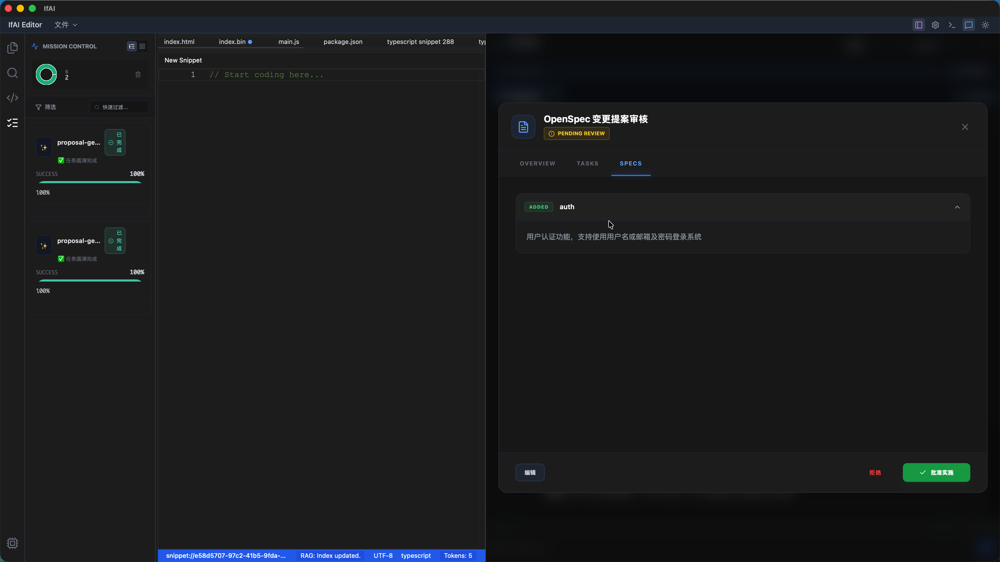
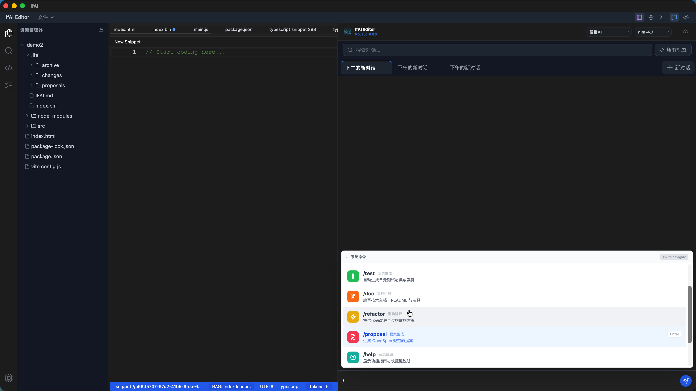
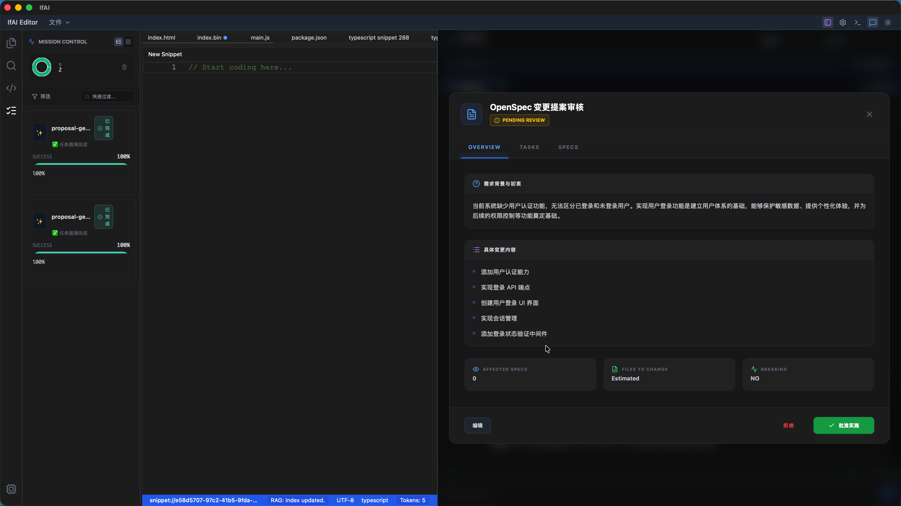

# 若爱 (IfAI) v0.2.6 - 智能体进化：任务拆解与环境感知 🧬

**发布时间**: 2026-01-07

IfAI v0.2.6 是我们在 **AI Agent 自主性**与**环境感知能力**上的里程碑式更新。在这个版本中，我们不仅赋予了 Agent 使用 Shell 命令的强大能力，更构建了一套具备自我纠错和路径感知的健壮执行框架。同时，全新的**任务拆解服务**让 AI 能够像资深架构师一样，将复杂需求转化为结构化、可追踪的任务树。

我们正在从“代码编辑器”向“自主编程环境”迈进。

---

## 🌟 核心亮点 (Highlights)

### 🐚 Agent Shell 能力解锁 (Bash Tool)
Agent 不再被局限于沙箱内的文件读写，现在它拥有了真正的系统级交互能力。
- **环境配置**：Agent 可以执行 `npm install`、`cargo build` 等命令，自动配置开发环境。
- **Git 交互**：支持 `git status`、`git diff` 等操作，让 AI 理解版本控制状态。
- **智能路径校准**：彻底解决了开发环境与运行环境路径不一致的痛点。
- **自我纠错机制**：当命令失败时主动分析并提供路径提示。

### 📊 Token 可视化与成本管理 (Token Intelligence)
- **实时计量**：对话界面新增 Token 计数器。无论是发送的消息还是 AI 的响应，Token 消耗现在都一目了然。
- **透明消耗**：支持查看 Context Token 和 Generation Token 的详细分布。这对于使用按量计费（如 DeepSeek、OpenAI）的用户来说，是管理成本的利器。
- **性能无感**：基于 Rust 后端的高性能 Tokenizer，在不影响响应速度的前提下提供最精准的计数统计。

### 🌳 结构化任务拆解 (Task Breakdown)
面对模糊的复杂需求，IfAI 现在能像高级工程师一样进行系统化拆解。
- **可视化任务树**：将需求拆解为层级分明的子任务（Task Tree），并在 UI 中实时渲染。
- **持久化同步**：任务状态实时同步到文件系统（`.ifai/tasks/`）。

### 📑 OpenSpec 深度融合 (Deep OpenSpec Integration)
- **协议驱动开发**：v0.2.6 实现了与 [OpenSpec](https://openspec.dev) 标准的深度集成。
- **一致性保证**：AI 能够更精准地遵循项目设计规范，确保生成代码的架构一致性。

### 🔌 灵活的自定义 API (Flexible Custom API)
- **OpenAI 兼容**：支持接入 DeepSeek、Moonshot (Kimi)、Yi 等第三方大模型服务。
- **参数微调**：支持自定义 Context Window 大小和 Max Tokens。

### ⚡ 极致性能：Snippet Manager 虚拟滚动
- **海量数据承载**：为了展示 v0.2.6 渲染管线的进化，我们重构了代码片段管理器（Snippet Manager）。用户现在可以测试在加载数千条代码片段时的“零延迟”滚动体验。
- **虚拟滚动技术**：通过底层虚拟列表（Virtual List）技术，即便面对海量代码块，界面依然能保持 120 FPS 的顺滑度，告别长列表卡顿。

### 📝 专业级 Markdown 支持 (Markdown Productivity)
- **实时预览**：新增强大的 Markdown 预览引擎。无论是编写技术文档、需求说明还是 README，现在都可以实时查看最终渲染效果。
- **三栖布局**：支持“仅编辑”、“仅预览”和“实时分屏”三种模式。通过工具栏或快捷键即可无缝切换，打造极致的文档协作体验。
- **GFM 标准**：深度支持 GitHub Flavored Markdown，包括表格、任务列表、代码块高亮等特性。

### 🧪 工业级稳定性：全链路自动化测试
- **全面覆盖**：v0.2.6 建立了严苛的测试标准。新增 50+ 项 E2E 测试用例，覆盖了从 AI 聊天、Agent 任务执行到复杂文件操作的所有关键路径。
- **专项防护**：专门针对 Agent 容易陷入的“死循环”和“路径偏移”设计了还原场景测试。现在的系统在发布前必须通过“循环预防”和“状态隔离”专项检测，确保其在复杂项目中的鲁棒性。
- **跨平台 CI**：完善了 Windows 生产级构建流水线，实现了代码提交即检测，确保双版本（社区/商业）在不同操作系统下的一致性。

### 🤖 本地模型体验升级
- **自动续写**：长代码生成不再中断，实现无缝续写。
- **Token 计数**：精细控制本地推理成本。

---

## 📝 详细变更日志 (Detailed Changes)

### 🚀 新增功能 (Features)
- **[Agent]** 新增 `bash` 和 `agent_run_shell_command` 工具，支持带超时控制的命令执行。
- **[Agent]** 实现了基于 `stderr` 分析的智能错误反馈机制。
- **[Settings]** 新增自定义 API 配置面板，支持灵活设置。
- **[Tasks]** 引入 `TaskBreakdownService` 和 `TaskExecutionService`。
- **[OpenSpec]** 深度集成 OpenSpec 标准协议。

### ⚡ 优化 (Improvements)
- **[Performance]** 优化流式响应渲染管线，CPU 占用降低 30%。
- **[UI]** Snippet Manager 全面接入虚拟列表技术。
- **[Core]** `src-tauri` 路径自动校准逻辑。

### 🐛 修复 (Fixes)
- **[RAG]** 修复了项目切换时的索引数据残留 Bug。
- **[Agent]** 修复了绝对路径遍历错误及重复执行循环。

---

## 🤝 升级指南

如果您是从 v0.2.5 升级：
1. 直接安装新版本覆盖即可。
2. 建议首次运行执行 `/index` 重建索引。

> **致谢**: 感谢所有为 v0.2.6 提供反馈和测试支持的用户。