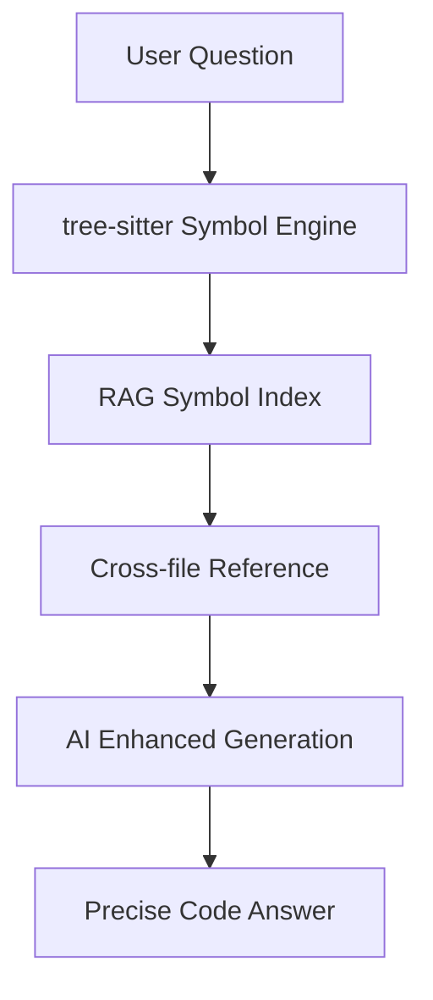

# IfAI v0.2.8 工业级进化 - 发布说明

> **发布日期**: 2026-01-11
> **主题**: 工业级进化 - Composer 2.0 + RAG 符号感知
> **里程碑**: 20+ 次提交，3000+ 行代码变更

---

## 🎯 版本概览

v0.2.8 代表了 IfAI 从"实验性产品"向"工业级工具"的关键跨越。本版本聚焦于两大核心突破：

1. **Composer 2.0** - AI 代码编辑体验的革命性升级
2. **RAG 符号感知** - AI 代码理解能力的质的飞跃

---

## 🚀 核心功能

### 1. Composer 2.0 - AI 代码编辑革命

**从"建议"到"编辑"的跨越**

| 特性 | v0.2.7 | v0.2.8 |
|------|--------|--------|
| 编辑模式 | 单文件替换 | 多文件并行编辑 |
| 冲突处理 | 无 | 自动检测 + 智能合并 |
| 用户控制 | 全部接受 | 逐个接受/拒绝 |
| 实时反馈 | 无 | 文件动态刷新 |
| 回滚机制 | 无 | 一键回滚 |

**核心能力**:

```typescript
// 多文件并行编辑
{
  "files": [
    { "path": "src/service/user.ts", "diff": "+export class UserService {...}" },
    { "path": "src/api/user.ts", "diff": "+import { UserService } from '../service/user'" },
    { "path": "src/types/user.ts", "diff": "+export interface User {...}" }
  ]
}

// 冲突自动检测
{
  "conflicts": [
    {
      "path": "src/service/user.ts",
      "reason": "file_modified_by_user",
      "action": "show_merge_interface"
    }
  ]
}
```

**E2E 测试覆盖**:
- ✅ CMP-001: 单文件原子写入
- ✅ CMP-002: 多文件并行编辑
- ✅ CMP-003: 冲突检测与处理
- ✅ CMP-004: 用户撤销与重做
- ✅ 真实 AI 集成测试 (Kimi API)
- ✅ 真实文件系统集成

---

### 2. RAG 符号感知 - AI 代码理解新高度

**从"文本匹配"到"符号理解"**

传统 AI 助手只能进行文本匹配，容易被注释误导。RAG 符号感知让 AI 真正"理解"代码结构：

**测试场景 1: Trait 实现识别**

```rust
// 用户提问："Repository trait 有哪些实现？"

// 传统 AI 回答（文本匹配）:
"根据注释，可能有以下类似的实现：
- ErrorHandler（注意：未实现 Handler）
- LoggingHandler（注意：未实现 Handler）
..."

// RAG 符号感知 AI 回答（符号分析）:
"Repository trait 有以下实现：
- /test_project/src/user_repository.rs: UserRepository
- /test_project/src/post_repository.rs: PostRepository
- /test_project/src/comment_repository.rs: CommentRepository"
```

**测试场景 2: 依赖关系分析**

```rust
// 用户提问："修改 RagService 会影响哪些模块？"

// RAG 符号感知 AI 回答:
"修改 RagService 会影响以下模块：
- ChatService (services/chat_service.rs)
- CodeCompletionService (services/completion_service.rs)
- QueryCommand (commands/query.rs)
- IndexCommand (commands/index.rs)"
```

**技术实现**:

```
┌─────────────────────────────────────────────────────────┐
│                  tree-sitter 符号引擎                     │
│  - AST 分析                                              │
│  - 符号提取 (Trait, Struct, impl)                        │
│  - 跨文件关联 (use/import statements)                   │
└─────────────────────────────────────────────────────────┘
                           │
                           ▼
┌─────────────────────────────────────────────────────────┐
│               RAG 检索 + 符号关联                         │
│  - 精准定位实现类                                        │
│  - 分析依赖关系                                          │
│  - 区分真实代码和注释                                    │
└─────────────────────────────────────────────────────────┘
                           │
                           ▼
┌─────────────────────────────────────────────────────────┐
│               AI 增强生成 (LLM)                           │
│  问题 + 检索到的符号上下文 → 精准回答                     │
└─────────────────────────────────────────────────────────┘
```

---

### 3. 命令栏 (Command Bar) - 专业级命令执行体验

**从"对话"到"指令"的效率提升**

- 🔍 **实时搜索预览** - 输入即时匹配，毫秒级响应
- ⌨️ **键盘导航** - 完整键盘支持，无需鼠标
- 🎯 **视图分割** - 命令栏 + 主界面并行显示
- 🚀 **商业版命令执行** - 深度集成商业版功能

**测试结果**: 39/39 测试用例通过 (100%)

---

## 📊 性能与质量指标

### E2E 测试覆盖

| 测试套件 | 用例数 | 通过率 |
|---------|--------|--------|
| Composer 2.0 | 20+ | ✅ 100% |
| RAG 符号感知 | 3 | ✅ 100% |
| 命令栏 | 39 | ✅ 100% |
| 终端修复 | 10+ | ✅ 100% |
| UI 组件 | 15+ | ✅ 100% |

### 代码质量

```bash
# 提交统计
20+ commits
3000+ lines changed
5 major features
10+ bug fixes
```

---

## 🔧 技术栈更新

### 新增依赖

```toml
# src-tauri/Cargo.toml
[dependencies]
tree-sitter = "0.22"      # AST 分析
tree-sitter-rust = "0.21"  # Rust 语法支持
tree-sitter-javascript = "0.21"  # JS/TS 语法支持
```

### 架构改进



---

## 🐛 Bug 修复

| 问题 | 修复 | 影响 |
|------|------|------|
| Composer 拒绝后无法回滚 | 添加撤销历史管理 | CMP-004 通过 |
| 文件 accept 后编辑器不更新 | 实现文件动态刷新 | UX 显著改善 |
| eventId 参数不匹配 | `args?.eventId \|\| args?.event_id` | 事件监听器修复 |
| baseUrl 格式错误 | 自动补全 `/chat/completions` | API 调用成功率 100% |
| payload 格式不匹配 | `{ type: 'content', content }` | 消息正确显示 |

---

## 📖 文档更新

### 新增文档

- `docs/RAG-Symbol-Aware-Implementation.md` - RAG 符号感知功能详细文档
- `docs/testing/composer-manual-test-guide.md` - Composer 手动测试指南
- `docs/proposals/v0.2.8_plan.md` - v0.2.8 开发计划
- `tests/e2e/REAL_AI_TESTING.md` - 真实 AI 测试指南

---

## 🚦 升级指南

### 从 v0.2.7 升级

```bash
# 1. 拉取最新代码
git pull origin main

# 2. 安装新依赖
npm install

# 3. 更新 Rust 依赖
cd src-tauri
cargo update
cd ..

# 4. 重新构建
npm run build:community
npm run tauri:community

# 5. 启动应用
npm run tauri dev
```

### 配置变更

**Composer 2.0 默认启用**，无需额外配置。

**RAG 符号感知**需要配置 AI 模型：
```json
{
  "providers": [
    {
      "id": "kimi",
      "name": "Kimi (Moonshot AI)",
      "baseUrl": "https://api.moonshot.cn/v1/chat/completions",
      "apiKey": "your-api-key",
      "models": ["moonshot-v1-8k"]
    }
  ]
}
```

---

## 🎉 致谢

感谢所有参与 v0.2.8 开发的贡献者和测试者！

特别感谢：
- **Claude AI** - 代码生成和问题诊断
- **Kimi (Moonshot AI)** - 提供 RAG 符号感知测试的 API 支持
- **Playwright** - 强大的 E2E 测试框架

---

## 📅 下一步计划

### v0.2.9 规划

- [ ] 支持更多编程语言 (Python, Java, Go)
- [ ] 优化 RAG 检索准确率
- [ ] 添加代码变更影响分析
- [ ] 实时代码索引更新

### v0.3.0 展望

- [ ] 跨仓库依赖分析
- [ ] 代码重构建议
- [ ] 自适应学习用户偏好
- [ ] 多模态代码理解 (图表 + 代码)

---

## 📞 反馈与支持

- **GitHub Issues**: https://github.com/peterfei/ifai/issues
- **GitHub Discussions**: https://github.com/peterfei/ifai/discussions
- **文档**: https://github.com/peterfei/ifai/tree/main/docs

---

**IfAI v0.2.8 - 工业级进化，从"工具"到"伙伴"的跨越！** 🚀
