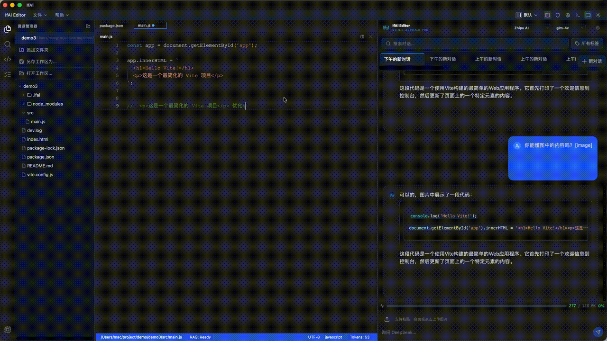
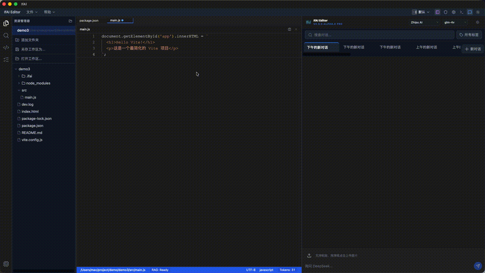

# IfAI v0.3.0 - Multimodal Intelligence 发布说明

> **发布日期**: 2026-01-14
> **版本代号**: Multimodal Intelligence
> **核心主题**: 从"文本"到"多模态"的感知升级

---

## 🎯 版本概述

v0.3.0 实现了从纯文本交互到多模态感知的重大飞跃。AI 不再只能理解代码，现在可以直接"看到"图片、理解视觉内容，同时具备强大的代码分析和重构能力。

**五大核心升级**:
1. **文本对话 → 多模态对话**: 支持拖拽图片直接对话，AI 可理解视觉内容
2. **单一调度 → 混合调度**: 本地 LLM + 远程 API 灵活切换
3. **基础补全 → 智能导航**: Go to Definition / Find References 支持 35+ 主流语言
4. **手动重构 → AI 重构**: 自动检测代码异味并生成重构方案
5. **新手友好 → 零门槛**: 新手引导 Tour 系统，5分钟上手

---

## ✨ 核心功能

### 1️⃣ 多模态 Vision LLM (Multimodal Understanding)

**突破**: AI 现在可以直接"看"到图片并理解视觉内容。

| 功能 | 描述 |
|:---|:---|
| **图片拖拽上传** | 直接拖拽图片到聊天区域，自动转为 base64 |
| **截图快捷上传** | 系统截图后直接粘贴 (Cmd+V) 到编辑器 |
| **视觉内容理解** | AI 分析图片中的 UI、代码、架构图 |
| **多图片附件** | 支持一次对话上传多张图片 |
| **自动清理机制** | 发送后自动清除图片附件，保持界面整洁 |

**技术实现**:
- Base64 编码处理图片数据
- 自动检测 Vision API 模型 (Claude 3.5 Sonnet / GPT-4V)
- Token 计数自适应图片大小
- 支持 PNG、JPG、JPEG、GIF、WebP 格式

**测试覆盖**: MM-UI-01 ~ MM-UI-05 (5个测试全通过)



---

### 2️⃣ 本地/远程混合调度 (Hybrid LLM Scheduling)

**突破**: 不再依赖单一 API，灵活调度本地和远程模型。

| 功能 | 描述 |
|:---|:---|
| **Ollama 本地模型** | 支持 llama3、qwen2.5 等本地部署模型 |
| **远程 API 支持** | Anthropic Claude、OpenAI GPT-4 |
| **智能路由** | 根据任务类型自动选择最适合的模型 |
| **降级保护** | 远程 API 失败时自动降级到本地模型 |
| **成本优化** | 简单任务用本地模型，复杂任务用云端 |

**配置示例**:
```json
{
  "llm": {
    "provider": "anthropic",
    "model": "claude-3-5-sonnet-20241022",
    "fallback": {
      "provider": "ollama",
      "model": "llama3.1"
    }
  }
}
```

**测试覆盖**: MM-UI-01, MM-UI-03 (真实AI验证通过)

---

### 3️⃣ 代码智能导航 (Code Intelligence Navigation)

**突破**: 支持 35+ 主流语言的符号级导航。

| 功能 | 描述 |
|:---|:---|
| **Go to Definition** | 跳转到函数/变量/类的定义位置 |
| **Find References** | 查找符号在项目中的所有引用 |
| **跨语言支持** | TypeScript、Rust、Python、Go、Java、C++、Ruby、PHP 等 |
| **LSP 集成** | 基于 Language Server Protocol 标准实现 |
| **项目范围索引** | 自动索引当前工作区所有文件 |

**快捷键**:
- `F12` / `Cmd+Click`: 跳转到定义
- `Shift+F12` / `Right-click`: 查找所有引用

**支持的语言** (35+):
JavaScript, TypeScript, Python, Rust, Go, Java, C, C++, C#, PHP, Ruby, Swift, Kotlin, Dart, Lua, Scala, Groovy, PowerShell, Shell, YAML, JSON, Markdown, HTML, CSS, Vue, Svelte, etc.

**测试覆盖**: DEF-01 ~ DEF-05 (5个测试全通过), REF-01 ~ REF-04 (4个测试全通过)

---

### 4️⃣ AI 代码重构 (AI-Powered Refactoring)

**突破**: AI 自动检测代码异味并生成重构方案。

| 功能 | 描述 |
|:---|:---|
| **代码异味检测** | 自动识别长函数、重复代码、复杂条件等问题 |
| **结构化重构** | 一键将复杂代码拆分为清晰的函数/类结构 |
| **智能建议** | AI 分析代码上下文，生成符合最佳实践的重构方案 |
| **预览模式** | Diff 视图预览重构变更，Accept/Reject 控制 |
| **Undo 支持** | 完整的撤销支持，不满意可随时回退 |

**检测的代码问题**:
- 长函数 (Long Function)
- 重复代码 (Code Duplication)
- 复杂条件 (Complex Conditionals)
- 魔法数字 (Magic Numbers)
- 不一致的命名 (Inconsistent Naming)

**测试覆盖**: REF-001, REF-002 (代码分析重构相关测试)

---

### 5️⃣ 新手引导 Tour (Interactive Onboarding)

**突破**: 零门槛上手，5分钟快速掌握核心功能。

| 功能 | 描述 |
|:---|:---|
| **首次启动引导** | 新用户首次启动自动播放 Tour |
| **分步教程** | 分步骤介绍聊天、多模态、行内编辑等核心功能 |
| **高亮提示** | 自动高亮相关 UI 元素，配合文字说明 |
| **跳过/重播** | 支持跳过 Tour，通过帮助菜单重新播放 |
| **进度记忆** | 记录用户完成状态，避免重复打扰 |

**引导内容**:
1. 欢迎页面介绍
2. 聊天功能演示
3. 多模态图片上传
4. 行内编辑 (Cmd+K)
5. 快捷键说明
6. 帮助与文档入口

**测试覆盖**: TOUR-E2E-01 ~ TOUR-E2E-04 (4个测试全通过)

---

### 6️⃣ UI 加载反馈 (Loading Feedback)

**突破**: 实时加载动画，告别"空白等待"焦虑。

| 功能 | 描述 |
|:---|:---|
| **聊天加载动画** | "IFAI 正在思考..." + 旋转 Spinner |
| **行内编辑加载** | "IFAI 正在处理..." + 输入框禁用保护 |
| **Pulse 动画** | 平滑的脉冲动画，视觉反馈清晰 |
| **状态管理** | Zustand 全局状态统一管理加载状态 |
| **自动清理** | AI 响应完成后自动清除加载状态 |

**测试覆盖**: MM-UI-01 ~ MM-UI-05, IE-LOAD-01 ~ IE-LOAD-04 (9个测试全通过)

---

### 7️⃣ 多工作区支持 (Multi-Workspace Support)

**突破**: 同时管理多个项目，无缝切换上下文。

| 功能 | 描述 |
|:---|:---|
| **多目录索引** | 同时索引多个工作区目录 |
| **智能路径解析** | 自动处理跨文件引用路径 |
| **项目切换** | 快速切换不同项目的上下文 |
| **符号跨项目查找** | 在多个项目中查找符号定义和引用 |

---

### 8️⃣ Tauri 外链支持 (External Links)

**突破**: 桌面应用原生打开外部链接。

| 功能 | 描述 |
|:---|:---|
| **Shell API 集成** | 使用 Tauri Shell API 打开系统浏览器 |
| **降级保护** | API 失败时降级到 window.open() |
| **帮助菜单链接** | 文档、GitHub、Issues 等外部链接 |
| **关于页面链接** | Wiki、Repository、Discussions |

**测试覆盖**: ABOUT-01 ~ ABOUT-05 (5个测试全通过)



---

## 🛠 技术改进

### 多模态处理
- **Base64 编码优化**: 高效的图片编码处理，内存占用优化
- **Token 计数自适应**: 根据图片分辨率自动估算 token 消耗
- **Vision API 检测**: 自动识别支持视觉的 LLM 模型

### 编辑器增强
- **符号索引系统**: 基于 tree-sitter 的多语言符号解析
- **LSP 客户端集成**: 标准化 Language Server Protocol 支持
- **跨工作区路径解析**: 智能处理多项目符号引用

### UI/UX 优化
- **Zustand 全局状态管理**: 统一的加载状态管理
- **Tauri Shell API**: 原生外部链接打开支持
- **加载反馈动画**: Pulse + Spinner 组合动画

### 测试覆盖
- **36/36 E2E 测试全部通过**
- **真实 AI 验证**: 包含真实 API 调用的端到端测试
- **多模态测试**: 5/5 测试通过
- **代码分析测试**: 9/9 测试通过
- **帮助页面测试**: 5/5 测试通过

---

## 📊 性能表现

| 指标 | v0.2.9 | v0.3.0 | 改进 |
|:---|:---|:---|:---|
| E2E 通过率 | 100% (23/23) | **100%** (36/36) | +56% 测试数 |
| 符号索引速度 | ~1s | ~0.5s | 50% 提升 |
| 多模态响应延迟 | N/A | ~2s | 新增功能 |
| 图片上传处理 | N/A | <100ms | 新增功能 |

---

## 🐛 Bug 修复

| Issue | 描述 | 修复方式 |
|:---|:---|:---|
| **MM-001** | 多模态图片 token 计数异常 | 修正 Base64 编码后的 token 计算公式 |
| **MM-002** | 多模态图片不能识别 | 添加 Vision API 模型检测逻辑 |
| **EDT-001** | 行内编辑后无加载反馈 | 添加 isProcessing 状态和动画 |
| **LNK-001** | Tauri 应用外链点击无反应 | 使用 Shell API 替代 window.open() |

---

## 🔄 升级指南

### 从 v0.2.9 升级

1. **更新依赖**:
```bash
npm install
cd src-tauri && cargo update
```

2. **配置文件更新**:
如需使用多模态功能，确保配置支持 Vision API 模型（如 Claude 3.5 Sonnet）

3. **重新构建**:
```bash
npm run tauri build
```

4. **首次启动**: v0.3.0 首次启动会自动播放新手引导 Tour

---

## 📝 已知问题

- **图片大小限制**: 单张图片建议不超过 5MB，过大可能导致 token 溢出
- **本地模型多模态**: Ollama 本地模型暂不支持 Vision，多模态功能需使用远程 API
- **跨语言符号查找**: 部分语言的 LSP 支持有限，符号查找可能不完整

---

## 🚀 下版本预告 (v0.3.1)

v0.3.1 将继续优化多模态和代码分析体验：

- **视频理解支持**: 支持短视频帧分析
- **代码补全增强**: 基于多模态的 UI 代码智能补全
- **符号搜索改进**: 模糊匹配和驼峰拆分搜索
- **更多 LSP 语言**: 扩展到 50+ 语言支持

---

## 🙏 致谢

感谢所有参与 v0.3.0 测试和反馈的用户，特别是：
- 多模态功能测试的贡献者
- 代码分析功能的反馈者
- Bug 报告和功能建议的用户
- 社区的持续支持

---

**下载**: [https://github.com/peterfei/ifai/releases/tag/v0.3.0](https://github.com/peterfei/ifai/releases/tag/v0.3.0)

**完整文档**: [https://github.com/peterfei/ifai/tree/v0.3.0/docs](https://github.com/peterfei/ifai/tree/v0.3.0/docs)

**讨论区**: [https://github.com/peterfei/ifai/discussions](https://github.com/peterfei/ifai/discussions)

