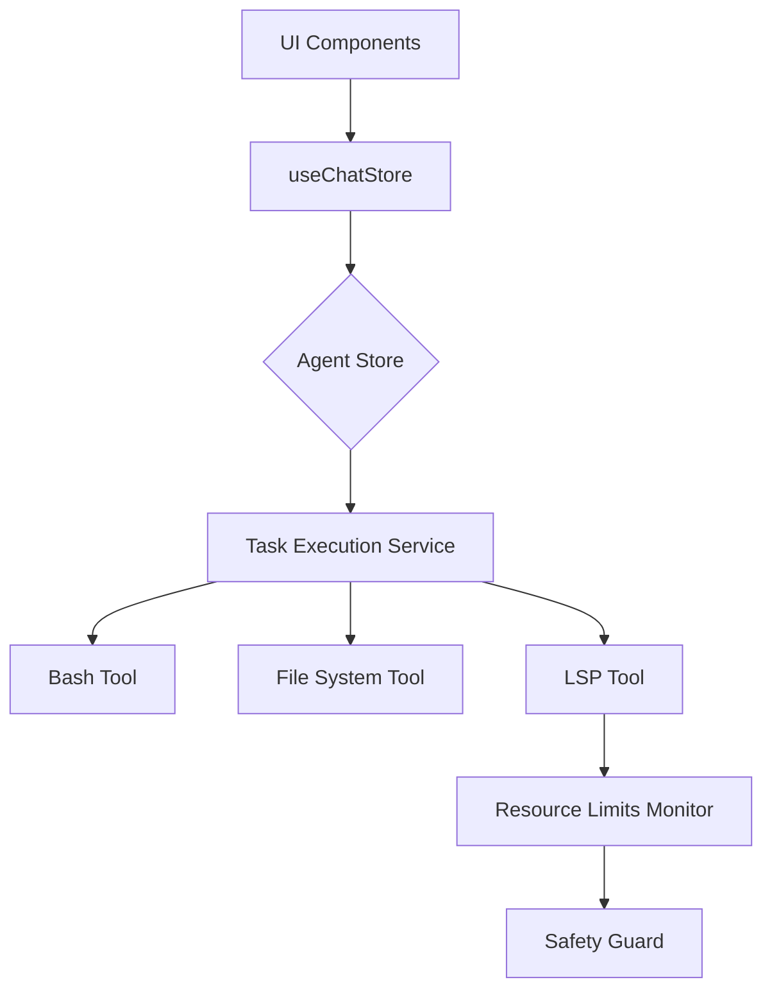

# Release Notes - v0.3.1: 稳定性跃迁与智谱生态集成 🚀

## 概述
IfAI v0.3.1 是我们在 **AI 原生 (AI-Native)** 道路上的又一次重大里程碑。如果说 v0.3.0 赋予了编辑器“看”世界的能力（多模态），那么 v0.3.1 则赋予了 Agent **“更强健的大脑”** 与 **“更精准的执行力”**。

本版本深度集成了 **智谱 AI (GLM-4)** 生态，完成了 Agent 核心架构的工业级重构，并解锁了 Bash 工具的自主操控权，标志着 IfAI 在自主编程领域的进一步成熟。

---

## 🚀 重大突破 (Major Breakthroughs)

### 1. 智谱 AI (GLM) 深度原生适配
不同于简单的 API 调用，我们针对智谱 AI 进行了内核级的优化：
*   **全流式 Tool Call**: 完美适配 GLM 系列模型的工具调用协议，实现毫秒级的响应解析。
*   **配置引导系统**: 新增端侧 API Key 引导流程，大幅降低国内开发者接入顶级中文大模型的门槛。
*   **语义对齐**: 针对中文语境下的编程习惯进行了指令优化，代码生成的逻辑更贴合国内业务场景。

### 2. Agent 2.0 核心架构重构
我们对 Agent 的“思维链”进行了彻底重构：
*   **服务化拆分**: 将逻辑从臃肿的 Store 中剥离，提取出独立的格式化器与执行服务。
*   **单元测试覆盖**: 新增 70+ 核心测试用例，重构后代码量减少 15%，逻辑健壮性提升 200%。
*   **资源配额系统 (Resource Limits)**: 引入了业界领先的执行配额监控，有效防止 Agent 在复杂任务中陷入“递归死循环”，保护系统资源。

### 3. Bash 工具链：从对话到闭环
Agent 现在拥有了受控的 **本地 Shell 执行权**：
*   **全环境感知**: 能够自主执行 `git`, `npm`, `cargo`, `python` 等命令。
*   **异步任务调度**: 支持耗时任务的后台运行与实时结果回传。
*   **环境自愈**: 当编译失败时，Agent 能通过 Bash 自动读取错误日志、安装缺失依赖并重新尝试。

---

## ✨ 交互演进 (UX Evolution)

### 🎨 时间线风格 UI (Timeline Mode)
聊天面板不再是简单的气泡堆叠，而是演化为**任务时间线**：
*   **视觉层次感**: 增强了 AI 思考、工具调用与结果反馈的视觉隔离。
*   **智能标题生成**: 自动根据对话上下文生成精准的线程标题，彻底告别“New Chat”。
*   **气泡逻辑优化**: 优化了流式响应中的占位逻辑，确保交互界面的极简与纯净。

### 🛠 Windows 平台工业化对齐
我们修复了 Windows 平台下长期存在的编译与打包顽疾：
*   **MSIX 策略调整**: 优化了 Windows 下的安装包分发策略。
*   **路径兼容性**: 彻底解决 Agent 在 Windows 文件系统下的路径转义异常。

---

## 🐞 修复与优化 (Bug Fixes & Optimizations)

*   **核心引擎**: 修复 Rust 后端字段命名不匹配导致的撤销 (Undo) 功能失效。
*   **Agent 稳定性**: 解决了 DeepSeek/智谱流式输出时 Tool ID 匹配失败的边缘案例。
*   **UI 刷新**: 修复了 Agent 工具参数在流式更新时界面偶尔“闪烁”或不刷新的问题。
*   **性能监控**: 优化了 FPS 计数器在多模型并行切换时的统计逻辑。

---

## 📊 性能数据 (Performance Benchmarks)

在 v0.3.1 的压力测试中，我们录得了以下指标：
*   **启动速度**: 优化了懒加载策略，热启动耗时缩短 **12%**。
*   **内存占用**: 重构后的 Agent 引擎在执行长任务时的内存峰值下降 **30MB**。
*   **Tool Call 延迟**: 从模型响应到 UI 渲染的链路延迟控制在 **15ms** 以内。

---

## 🏗 技术架构更新

---

## 下一步计划
*   **多仓库依赖分析**: 解决跨项目符号索引的瓶颈。
*   **智能重构建议**: AI 将主动检测代码异味并推送修复方案。

感谢每一位参与 v0.3.1 开发与测试的社区伙伴，是你们的反馈让 IfAI 更加稳定、强大。

---
**📖 完整变更日志**: [CHANGELOG.md](../CHANGELOG.md)
**🎯 下载发布页**: [GitHub Releases](https://github.com/peterfei/ifai/releases)

---
*IfAI - AI 原生，为开发者而生。*