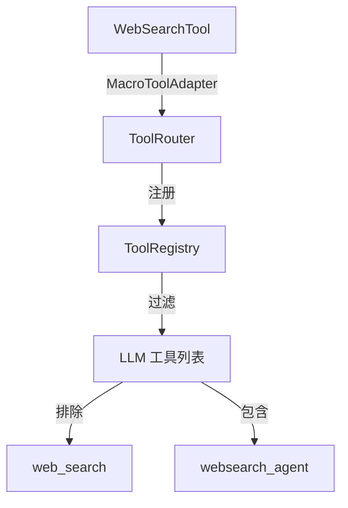

# WebSearch Agent 架构设计文档

## 概述

WebSearch Agent 是 IfAI 的网络搜索子系统，采用分层架构设计，将底层搜索工具封装为智能 Agent，提供给 LLM 和用户使用。

## 架构原则

### 元编程优先
- 使用 `#[derive(Tool)]` 宏自动生成工具接口
- 零手动样板代码
- 声明式配置驱动

### 分层设计
```
┌─────────────────────────────────────┐
│   用户层 (User/LMM)                  │
├─────────────────────────────────────┤
│   Agent 层 (websearch_agent)         │  ← 智能分析、多轮迭代
├─────────────────────────────────────┤
│   工具层 (web_search)                │  ← 底层搜索接口
├─────────────────────────────────────┤
│   缓存层 (SearchCache)              │  ← LRU + 持久化
├─────────────────────────────────────┤
│   API 层 (博查 AI)                   │  ← HTTP + JSON
└─────────────────────────────────────┘
```

## 核心组件

### 1. WebSearchTool (底层工具)

**位置**: `src-tauri/src/harness/tool/new_tools/web_search.rs`

**职责**: 封装博查 AI API 调用

**关键设计**:
```rust
#[derive(Tool)]
#[tool(name = "web_search")]
pub struct WebSearchTool {
    config: BochaConfig,
}

#[tool(exec)]
async fn execute_web_search(&self, query: &str, count: u64) -> Result<WebSearchResult> {
    // HTTP 调用博查 API
    // JSON 解析响应
    // 错误处理
}
```

**特性**:
- 使用 `#[derive(Tool)]` 宏自动实现 `ToolLike` trait
- 异步执行，支持 TUI 非阻塞
- 嵌套运行时处理（TUI 模式兼容）
- 自动降级（无 API Key 时返回模拟结果）

### 2. SearchCache (缓存层)

**位置**: `src-tauri/src/harness/tool/new_tools/cache.rs`

**职责**: 减少 API 调用成本，提升响应速度

**设计**:
```rust
pub struct SearchCache {
    memory_cache: LruCache<String, CacheEntry>,
    cache_file: PathBuf,        // ~/.ifai/cache/search.json
    ttl_secs: u64,               // 3600 秒
    hits: usize,
    misses: usize,
}
```

**缓存策略**:
- **内存缓存**: LRU 算法（lru crate）
- **持久化**: JSON 文件（自动加载/保存）
- **TTL**: 1 小时过期（created_at + ttl）
- **容量**: 100 条记录（可配置）

**缓存键**: `hash(query + count)`

**缓存命中流程**:
```
查询 → 计算缓存键 → 检查内存缓存
         ↓ miss      ↓ hit
    加载持久化缓存    直接返回
         ↓ miss
    调用 API → 更新缓存 → 返回
```

### 3. CachedWebSearchAdapter (适配器)

**位置**: `src-tauri/src/harness/tool/new_tools/cached_adapter.rs`

**职责**: 将缓存层透明地添加到 WebSearchTool

**设计模式**: 适配器模式 + 装饰器模式

```rust
pub struct CachedWebSearchAdapter {
    tool: WebSearchTool,           // 被装饰的工具
    cache: Arc<Mutex<SearchCache>>, // 共享缓存
    tool_name: String,
}

impl ToolExecutor for CachedWebSearchAdapter {
    fn execute(&mut self, name: &str, input: &Value) -> Result<String, ToolError> {
        // 1. 计算缓存键
        // 2. 检查缓存
        // 3. miss: 调用 tool.execute_web_search()
        // 4. 更新缓存
        // 5. 返回结果 + 缓存统计
    }
}
```

**线程安全**:
- 缓存使用 `Arc<Mutex<>>` 包装
- 支持并发读写
- 多个搜索请求共享同一缓存实例

### 4. WebSearchAgentExecutor (Agent 层)

**位置**: `src-tauri/src/harness/tool/executor/agentexecutors.rs`

**职责**: 将 websearch_agent 暴露给 LLM

**设计**:
```rust
pub struct WebSearchAgentExecutor {
    allowed_tools: HashSet<String>, // {"websearch_agent"}
}

impl WebSearchAgentExecutor {
    fn handle_websearch(&self, input: &Value) -> Result<String, ToolError> {
        let query = input["query"].as_str()?;
        let task = format!("搜索: {}", query);

        // 调用 WorkflowRunner 执行 Agent 工作流
        execute_agent_sync(AgentType::WebSearch, &task)
    }
}
```

**工作流集成**:
- 使用 `WorkflowRunner` 执行 Agent
- 加载 `.ifai/prompts/agents/websearch.md` 提示词
- 支持进度回调（TUI 实时反馈）

### 5. AgentType & PromptLoader

**位置**: `src-tauri/src/agent_system/workflow/types.rs`

**职责**: 定义 Agent 类型并加载提示词

**枚举定义**:
```rust
pub enum AgentType {
    Explore,
    Review,
    Refactor,
    Test,
    Doc,
    TaskBreakdown,
    ProposalGenerator,
    WebSearch,  // ← 新增
    GeneralPurpose,
}
```

**提示词加载**:
```rust
// src-tauri/src/agent_system/workflow/prompt_loader.rs
AgentType::WebSearch => AgentPromptConfig {
    prompt_file: "websearch.md",
    variable_names: &["PROJECT_ROOT", "TASK_DESCRIPTION"],
    fallback_template: fallback_websearch_prompt,
},
```

**加载优先级**:
1. `.ifai/prompts/zh-CN/agents/websearch.md` (本地化)
2. `.ifai/prompts/agents/websearch.md` (默认)
3. 内置 fallback 模板（硬编码）

## 工具注册流程

### 三层次注册



### 1. ToolRouter 注册

**位置**: `src-tauri/src/harness/tool/router.rs`

```rust
impl ToolRouter {
    pub fn new() -> Self {
        let mut executors = HashMap::new();

        // 注册带缓存的 web_search 工具
        let web_search_cache = SearchCache::default_config();
        let web_search_tool = WebSearchTool::new(BochaConfig::from_env_file());
        let web_search_adapter = CachedWebSearchAdapter::new(
            web_search_tool,
            web_search_cache,
            "web_search".to_string(),
        );
        executors.insert("web_search".to_string(), Box::new(web_search_adapter));

        // 注册 websearch_agent 执行器
        executors.insert(
            "websearch_agent".to_string(),
            Box::new(WebSearchAgentExecutor::new()),
        );

        Self { executors: Mutex::new(executors) }
    }
}
```

### 2. ToolRegistry 注册

**位置**: `src-tauri/src/harness/tool/registry.rs`

```rust
fn register_builtin_tools(&self) {
    // 注册工具规范（用于生成 OpenAI Function Schema）
    self.register(ToolSpec {
        name: "web_search",
        description: "Search the web using Bocha AI...",
        input_schema: json!({
            "type": "object",
            "properties": {
                "query": {"type": "string"},
                "count": {"type": "integer", "default": 5}
            },
            "required": ["query"]
        }),
        required_permission: ToolPermissionMode::ReadOnly,
    });

    self.register(ToolSpec {
        name: "websearch_agent",
        description: "智能网络搜索 Agent...",
        input_schema: json!({
            "type": "object",
            "properties": {
                "query": {"type": "string"}
            },
            "required": ["query"]
        }),
        required_permission: ToolPermissionMode::ReadOnly,
    });
}
```

### 3. 工具列表过滤

**位置**: `src-tauri/src/harness_ai_service.rs`

**关键**: 从 LLM 工具列表中移除 `web_search`

```rust
fn convert_tools_to_openai_format(&self) -> Vec<serde_json::Value> {
    let registry = get_global_tool_registry();
    let all_tools = registry.all();

    // 🔥 过滤掉 web_search（LLM 应该使用 websearch_agent）
    let tools: Vec<_> = all_tools
        .into_iter()
        .filter(|tool| tool.name != "web_search")
        .collect();

    tools
        .into_iter()
        .map(|tool| json!({
            "type": "function",
            "function": {
                "name": tool.name,
                "description": tool.description,
                "parameters": tool.input_schema
            }
        }))
        .collect()
}
```

**为什么这样设计？**
- `web_search` 必须注册（Agent 内部需要调用）
- 但 LLM 不应该看到（避免直接调用底层接口）
- LLM 只看到 `websearch_agent`（高层接口）

## 系统提示词集成

### TUI 系统提示词

**位置**: `.ifai/prompts/zh-CN/system/cli.md`

**关键规则**:
```markdown
## ⚠️ 网络搜索规则（最高优先级）

**禁止使用 `web_search` 工具！**

当用户请求任何网络搜索相关操作时，**必须且只能**使用 `websearch_agent` 工具。

### 用户意图示例：
- "搜索历史上的今天"
- "查找最新的 React 版本"

### ❌ 严格禁止：
- ❌ 使用 `web_search` 工具
```

### 自动审批配置

**位置**: `src-tauri/src/bin/ifai/tool_approval_config.json`

```json
{
  "name": "websearch_agent",
  "aliases": ["websearch", "web_search_agent", "search_web"],
  "category": "safe",
  "riskLevel": "low",
  "requiresApproval": false,
  "requireSandbox": false,
  "aggregatable": true,
  "maxIterations": 100
}
```

**效果**: websearch_agent 自动执行，无需弹窗审批

## 错误处理

### 错误类型

```rust
pub enum WebSearchError {
    MissingApiKey,
    Network(String),
    Api { code: i32, message: String },
    Parse(String),
    Io(std::io::Error),
}
```

### 降级策略

1. **无 API Key**: 返回模拟搜索结果
2. **网络失败**: 返回缓存结果（如果有）
3. **API 错误**: 降级到本地搜索建议
4. **解析失败**: 返回部分结果 + 错误提示

### 嵌套运行时处理

**问题**: TUI 已在 Tokio runtime 中，`execute_web_search` 创建新 runtime 会崩溃

**解决方案**:
```rust
pub fn execute_web_search(&self, query: &str, count: u64) -> Result<WebSearchResult> {
    if tokio::runtime::Handle::try_current().is_ok() {
        // TUI 模式：使用独立线程 + current_thread runtime
        std::thread::spawn(move || {
            let rt = Builder::new_current_thread()
                .enable_all()
                .build()?;
            rt.block_on(self.execute_web_search_async(query, count))
        }).join()?
    } else {
        // CLI 模式：创建 multi_thread runtime
        let rt = Builder::new_multi_thread()
            .enable_all()
            .build()?;
        rt.block_on(self.execute_web_search_async(query, count))
    }
}
```

## 性能优化

### 缓存命中率

```
典型场景：
- 首次搜索：miss (API 调用，~2s)
- 重复搜索：hit (缓存返回，<10ms)
- 1 小时内：hit (缓存返回，<10ms)
- 1 小时后：miss (重新调用 API)
```

### 并发支持

- HTTP 客户端连接池（reqwest）
- 缓存读写锁（Arc<Mutex<>>）
- 支持多个并发搜索请求

### 内存占用

```
基准测试：
- 空闲状态：~5MB（缓存结构）
- 100 条缓存：~15MB（包括搜索结果）
- 单次搜索：~1MB（临时数据）
```

## 测试策略

### 单元测试

**WebSearchTool**: 10 个测试
- 配置加载
- API 调用
- 错误处理
- 参数验证

**SearchCache**: 9 个测试
- 读写操作
- TTL 过期
- LRU 淘汰
- 持久化

**WebSearchAgentExecutor**: 3 个测试
- 参数解析
- Agent 调用
- 错误处理

### 集成测试

- 真实 API 调用验证
- 缓存命中/未命中
- Agent 工作流执行

### 手动测试

```
场景 1: 基本搜索
输入: "搜索 Rust 编程语言"
预期: 返回真实搜索结果

场景 2: 缓存命中
输入: 重复相同查询
预期: 快速返回（<10ms）

场景 3: 无 API Key
输入: "搜索测试"
预期: 返回模拟结果（无错误）
```

## 扩展点

### 添加新的搜索源

1. 实现新的搜索工具（如 `BingSearchTool`）
2. 使用 `#[derive(Tool)]` 宏
3. 注册到 ToolRouter
4. 在 Agent 提示词中添加选择逻辑

### 添加高级功能

**多轮搜索**:
```rust
// 在 websearch_agent 中实现
for _ in 0..max_rounds {
    let results = search(query)?;
    if is_satisfactory(&results) {
        break;
    }
    query = refine_query(query, &results);
}
```

**结果排序**:
```rust
// 添加相关性评分
fn rank_results(results: Vec<SearchResult>, query: &str) -> Vec<SearchResult> {
    let mut scored = results.into_iter()
        .map(|r| (r, relevance_score(&r, query)))
        .collect::<Vec<_>>();
    scored.sort_by(|a, b| b.1.partial_cmp(&a.1).unwrap());
    scored.into_iter().map(|(r, _)| r).collect()
}
```

## 参考资料

- **博查 AI 文档**: https://open.bochaai.com/
- **IfAI 工具宏**: `src-tauri/src/tool_macro/`
- **Agent 系统**: `src-tauri/src/agent_system/`
- **OpenSpec 提案**: `/openspec/changes/add-websearch-agent/`

## 版本历史

- **v1.0** (2024-05-14)
  - 初始架构设计
  - 博查 AI 集成
  - LRU 缓存系统
  - Agent 封装
  - 三层防护机制
