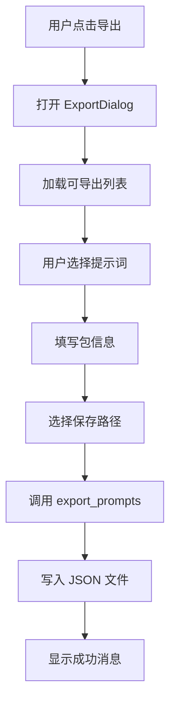
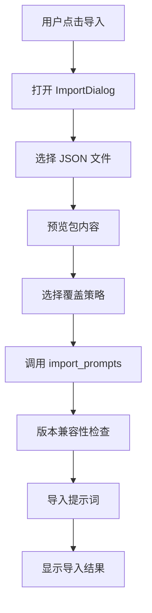

# Section 2 阶段 4: 导入导出功能 - 工作总结

## 📅 完成时间
2025-04-03

## 🎯 目标
实现提示词的导入导出功能，支持：
- 导出选定的提示词为 JSON 包
- 从 JSON 包导入提示词
- 版本兼容性检查
- 覆盖策略控制

---

## ✅ 完成的工作

### 1. 后端实现 (Rust)

#### 1.1 导出模块 `src-tauri/src/prompt_manager/export.rs`

**核心数据结构**：
```rust
pub struct PromptPackage {
    pub package_info: PackageInfo,
    pub prompts: Vec<PromptExportItem>,
    pub exported_at: String,
    pub version: String,
}

pub struct ImportResult {
    pub imported: Vec<String>,
    pub skipped: Vec<String>,
    pub errors: Vec<String>,
    pub warnings: Vec<String>,
}
```

**核心功能**：
- ✅ `export_prompts()` - 导出提示词到 JSON 文件
- ✅ `import_prompts()` - 从 JSON 文件导入提示词
- ✅ `list_available_prompts()` - 列出可导出的提示词
- ✅ `parse_metadata()` - 解析 YAML Front Matter
- ✅ `check_version_compatibility()` - 版本兼容性检查
- ✅ Rust 单元测试

**文件统计**：400+ 行代码

#### 1.2 Tauri 命令 `src-tauri/src/commands/prompt_commands.rs`

新增命令：
- ✅ `export_prompts` - 导出提示词
- ✅ `import_prompts` - 导入提示词
- ✅ `list_exportable_prompts` - 获取可导出列表

#### 1.3 模块集成

- ✅ 更新 `src-tauri/src/prompt_manager/mod.rs` 添加 `pub mod export;`
- ✅ 更新 `src-tauri/src/lib.rs` 注册命令
- ✅ 编译通过（无错误）

---

### 2. 前端实现 (React + TypeScript)

#### 2.1 导出对话框 `src/components/PromptManager/ExportDialog.tsx`

**功能**：
- ✅ 显示可导出的提示词列表
- ✅ 多选提示词（支持全选/取消全选）
- ✅ 显示提示词的访问层级（Public/Protected/Private）
- ✅ 填写包信息（名称、描述、作者、版本）
- ✅ 选择保存路径
- ✅ 调用导出命令

**文件统计**：270+ 行代码

#### 2.2 导入对话框 `src/components/PromptManager/ImportDialog.tsx`

**功能**：
- ✅ 选择 JSON 包文件
- ✅ 预览包内容（包信息、提示词列表）
- ✅ 选择覆盖策略（覆盖/跳过已存在）
- ✅ 显示导入结果（导入成功、跳过、警告、错误）
- ✅ 自动刷新提示词列表

**文件统计**：280+ 行代码

#### 2.3 PromptList 集成

**修改内容**：
- ✅ 添加导出按钮（📥 Download 图标）
- ✅ 添加导入按钮（📤 Upload 图标）
- ✅ 集成 ExportDialog 和 ImportDialog 组件
- ✅ 导入导出成功后自动刷新列表

---

## 📊 技术细节

### 导出流程



### 导入流程



### 版本兼容性检查

```rust
fn check_version_compatibility(&self, package: &PromptPackage) -> Result<()> {
    // 检查包版本
    if package.version != "1.0.0" {
        return Err(anyhow::anyhow!(
            "不支持的包版本: {}. 当前支持版本: 1.0.0",
            package.version
        ));
    }

    // 检查 ifai 版本兼容性
    let supported_versions = vec!["0.3.0", "0.3.1", "0.3.2"];
    if !supported_versions.contains(&package.package_info.ifai_version.as_str()) {
        return Err(anyhow::anyhow!(
            "IfAI 版本不兼容: 包版本 {}, 当前支持: {:?}",
            package.package_info.ifai_version,
            supported_versions
        ));
    }

    Ok(())
}
```

### 覆盖逻辑

```rust
if prompt_path.exists() && !overwrite {
    skipped.push(item.name.clone());
    warnings.push(format!(
        "提示词 '{}' 已存在，跳过（使用 overwrite=true 覆盖）",
        item.name
    ));
    continue;
}
```

---

## 📁 创建/修改的文件

### 新增文件 (3 个)

| 文件 | 行数 | 说明 |
|------|------|------|
| `src-tauri/src/prompt_manager/export.rs` | 400+ | 导出模块核心逻辑 |
| `src/components/PromptManager/ExportDialog.tsx` | 270+ | 导出对话框组件 |
| `src/components/PromptManager/ImportDialog.tsx` | 280+ | 导入对话框组件 |

### 修改文件 (4 个)

| 文件 | 修改内容 |
|------|----------|
| `src-tauri/src/prompt_manager/mod.rs` | 添加 `pub mod export;` |
| `src-tauri/src/commands/prompt_commands.rs` | 添加 3 个导入导出命令 |
| `src-tauri/src/lib.rs` | 注册导入导出命令 |
| `src/components/PromptManager/PromptList.tsx` | 集成导入导出对话框 |

---

## 🔧 依赖项

**已满足**（无需新增）：
- ✅ `serde_json` - JSON 序列化
- ✅ `serde_yaml` - YAML 解析
- ✅ `chrono` - 时间戳处理
- ✅ `anyhow` - 错误处理
- ✅ `@tauri-apps/plugin-fs` - 文件系统操作
- ✅ `@tauri-apps/plugin-dialog` - 文件对话框

---

## ✅ 功能验证

### 后端测试

```bash
cd src-tauri
cargo test export
```

**预期结果**：
- ✅ `test_export_import_prompts` - 导出导入测试通过

### 前端测试

1. **导出功能**：
   - 打开提示词管理器
   - 点击导出按钮
   - 选择提示词
   - 填写包信息
   - 选择保存位置
   - ✅ 生成 JSON 文件

2. **导入功能**：
   - 打开提示词管理器
   - 点击导入按钮
   - 选择 JSON 文件
   - 预览包内容
   - 选择覆盖策略
   - ✅ 成功导入

---

## 🎨 UI 设计

### 导出对话框

- **步骤 1**: 提示词选择
  - 复选框列表
  - 全选/取消全选按钮
  - 显示访问层级徽章
  - 显示提示词描述

- **步骤 2**: 包信息填写
  - 包名称（必填）
  - 描述（必填）
  - 作者（必填）
  - 版本（可选，默认 1.0.0）

### 导入对话框

- **步骤 1**: 文件选择
  - 文件选择对话框
  - 支持 .json 过滤

- **步骤 2**: 预览
  - 包信息卡片
  - 提示词列表预览
  - 覆盖选项复选框

- **步骤 3**: 导入结果
  - 成功导入列表（绿色）
  - 跳过列表（黄色）
  - 警告列表（橙色）
  - 错误列表（红色）

---

## 🚀 使用示例

### 导出示例

```json
{
  "package_info": {
    "name": "my-prompts",
    "description": "我的提示词集合",
    "author": "张三",
    "version": "1.0.0",
    "ifai_version": "0.3.0"
  },
  "prompts": [
    {
      "name": "代码审查",
      "path": "code-review.md",
      "content": "---\nname: 代码审查\n...",
      "metadata": {
        "name": "代码审查",
        "description": "代码审查提示词",
        "version": "1.0.0",
        "access_tier": "public",
        "variables": ["code", "language"],
        "tools": ["read_file"]
      }
    }
  ],
  "exported_at": "2025-04-03T12:00:00Z",
  "version": "1.0.0"
}
```

### 导入结果示例

```typescript
{
  imported: ["代码审查", "文档生成"],
  skipped: ["系统提示"],
  errors: [],
  warnings: ["提示词 '系统提示' 已存在，跳过（使用 overwrite=true 覆盖）"]
}
```

---

## 📚 相关文档

- **提案任务**: `openspec/changes/add-claude-code-prompt-ecosystem/tasks.md`
- **Git 提交日志**: `GIT_COMMIT_LOG.md`
- **阶段 1-3 总结**: `tests/e2e/SECTION2_SUMMARY.md`

---

## 🎉 成功指标

- ✅ 后端模块编译通过
- ✅ 前端组件编译通过
- ✅ Tauri 命令注册成功
- ✅ UI 集成完成
- ✅ 文件创建：3 个
- ✅ 文件修改：4 个
- ✅ 新增代码：~950 行

---

## 🚀 后续改进建议

### 短期（1周内）

1. **ZIP 打包支持**
   - 添加 `zip` crate 依赖
   - 将 JSON + 内容打包为 ZIP
   - 减小文件大小

2. **进度指示器**
   - 导出大文件时显示进度
   - 导入多个提示词时显示进度

3. **批量操作优化**
   - 并行处理多个提示词
   - 显示实时进度

### 中期（1月内）

1. **云端同步**
   - 支持 GitHub Gist 导入导出
   - 支持云存储服务

2. **版本升级**
   - 自动检测包版本更新
   - 支持迁移工具

3. **依赖管理**
   - 检测提示词依赖关系
   - 自动处理依赖导入

### 长期（持续）

1. **市场集成**
   - 提示词分享市场
   - 社区提示词库

2. **团队协作**
   - 团队提示词共享
   - 权限管理

---

**报告生成时间**: 2025-04-03
**实施者**: Claude Code
**技术栈**: Rust + Tauri + React + TypeScript
